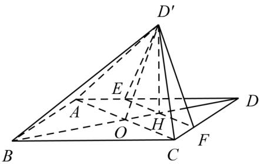

<!-- question-source:start -->
56.（2016·全国·高考真题）如图，菱形ABCD的对角线AC与BD交于点O,AB=5,AC=6，点E,F分别在AD,CD上，AE=CF= $\frac{5}{4}$ ,EF交BD于点H，将 $\Delta DEF$ 沿EF折到 $\Delta D'EF$ 位置， $OD'=\sqrt{10}$ .

(1) 证明： $D'H \perp$ 平面 ABCD；

(2) 求二面角 $B - D'A - C$ 的正弦值.

<!-- question-source:end -->

![[高中/真题/按题型分类/专题21 立体几何大题综合/考点02_空间中的垂直关系_第一问_/真题/answers/Q00035833A1.md]]
