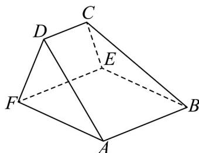

<!-- question-source:start -->
57.（2016·全国·高考真题）如图，在以A，B，C，D，E，F为顶点的五面体中，四边形ABEF为正方形，AF=2FD， $\angle AFD=90^{\circ}$ ，且二面角D-AF-E与二面角C-BE-F都是 $60^{\circ}$ .

<!-- question-source:end -->

![[高中/真题/按题型分类/专题21 立体几何大题综合/考点02_空间中的垂直关系_第一问_/真题/answers/Q00035834A1.md]]
