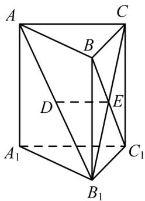

<!-- question-source:start -->
59.（2015·江苏·高考真题）如图，在直三棱柱 $ABC-A_{1}B_{1}C_{1}$ 中，已知 $AC\perp BC$ ， $BC=CC_{1}$ ，设 $AB_{1}$ 的中点为D， $B_{1}C\cap BC_{1}=E$ .

求证： $(1)$ $DE \parallel$ 平面 $AA_{1}C_{1}C$ ；
<!-- question-source:end -->

![[高中/真题/按题型分类/专题21 立体几何大题综合/考点02_空间中的垂直关系_第一问_/真题/answers/Q00035836A1.md]]
