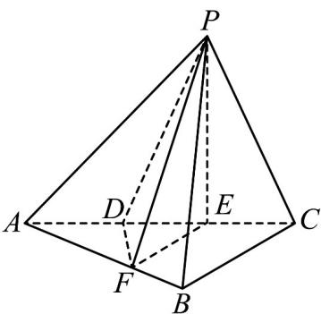

<!-- question-source:start -->
60. (2015·重庆·高考真题) 如图, 三棱锥 P-ABC 中, 平面 PAC⊥平面 ABC, ∠ABC= $\frac{\pi}{2}$ , 点 D、E 在线段 AC

上，且 $AD = DE = EC = 2$ ， $PD = PC = 4$ ，点 $F$ 在线段 $AB$ 上，且 $EF / / BC$

(I)证明：AB⊥平面PFE.

(II)若四棱锥 P-DFBC 的体积为 7，求线段 BC 的长.

<!-- question-source:end -->

![[高中/真题/按题型分类/专题21 立体几何大题综合/考点02_空间中的垂直关系_第一问_/真题/answers/Q00035837A1.md]]
