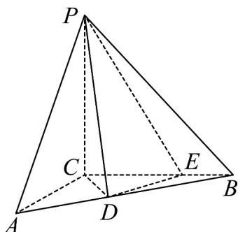

<!-- question-source:start -->
61. (2015·重庆·高考真题) 如图, 三棱锥 $P - ABC$ 中, $PC \perp$ 平面

$ABC, PC=3, \angle ACB=\frac{\pi}{2}. D, E$ 分别为线段 $AB, BC$ 上的点，且 $CD=DE=\sqrt{2}, CE=2EB=2.$
<!-- question-source:end -->

![[高中/真题/按题型分类/专题21 立体几何大题综合/考点02_空间中的垂直关系_第一问_/真题/answers/Q00035838A1.md]]
