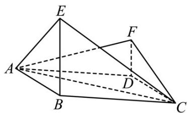

<!-- question-source:start -->
65. (2015·全国·高考真题) (2015 新课标全国I理科) 如图, 四边形 $ABCD$ 为菱形, $\angle ABC = 120^{\circ}$ , $E$ , $F$ 是平面 $ABCD$ 同一侧的两点, $BE^{\perp}$ 平面 $ABCD$ , $DF^{\perp}$ 平面 $ABCD$ , $BE = 2DF$ , $AE^{\perp}EC$ .

(1) 证明：平面 $AEC \perp$ 平面 $AFC$ ；

(2) 求直线 $AE$ 与直线 $CF$ 所成角的余弦值.
<!-- question-source:end -->

![[高中/真题/按题型分类/专题21 立体几何大题综合/考点02_空间中的垂直关系_第一问_/真题/answers/Q00035842A1.md]]
