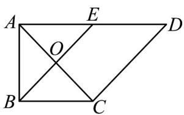
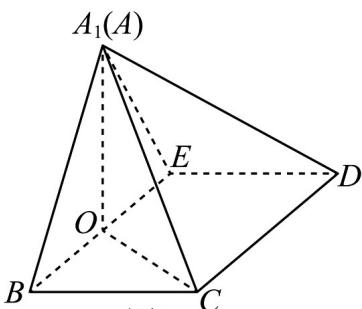

<!-- question-source:start -->
67．（2015·陕西·高考真题）如图1，在直角梯形ABCD中，AD//BC， $\angle BAD=\frac{\pi}{2}$ ，AB=BC=1，
AD=2，E是AD的中点，O是AC与BE的交点。将 $\Delta ABE$ 沿BE折起到 $\Delta A_{1}BE$ 的位置，如图2。

图1
图2

(Ⅰ) 证明：CD⊥平面 $A_{1}OC$ ;

(Ⅱ) 若平面 $A_{1}BE \perp$ 平面 BCDE，求平面 $A_{1}BC$ 与平面 $A_{1}CD$ 夹角的余弦值.
<!-- question-source:end -->

![[高中/真题/按题型分类/专题21 立体几何大题综合/考点02_空间中的垂直关系_第一问_/真题/answers/Q00035844A1.md]]
