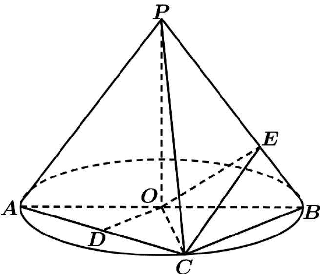

<!-- question-source:start -->
71．（2015·福建·高考真题）如图，AB 是圆 O 的直径，点 C 是圆 O 上异于 A, B 的点，PO 垂直于圆 O 所在的平面，且 PO = OB = 1．

(Ⅰ) 若 D 为线段 AC 的中点，求证 AC ⊥ 平面 PDO；

(Ⅱ) 求三棱锥 P-ABC 体积的最大值；

(Ⅲ) 若 $BC = \sqrt{2}$ ，点 E 在线段 PB 上，求 $CE + OE$ 的最小值。
<!-- question-source:end -->

![[高中/真题/按题型分类/专题21 立体几何大题综合/考点02_空间中的垂直关系_第一问_/真题/answers/Q00035848A1.md]]
