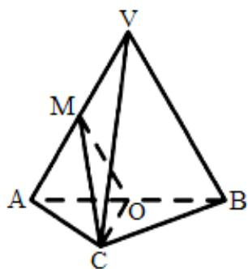

<!-- question-source:start -->
72．（2015·北京·高考真题）如图，在三棱锥 V-ABC 中，平面 $VAB \perp$ 平面 ABC， $\Delta VAB$ 为等边三角形，AC ⊥ BC 且 AC = BC = $\sqrt{2}$ ，O，M 分别为 AB，VA 的中点．

<!-- question-source:end -->

![[高中/真题/按题型分类/专题21 立体几何大题综合/考点02_空间中的垂直关系_第一问_/真题/answers/Q00035849A1.md]]
