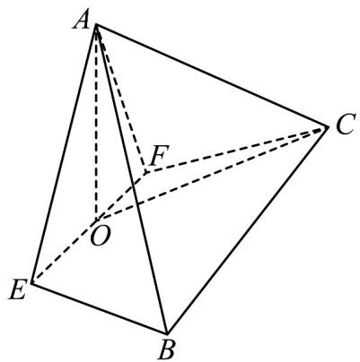

<!-- question-source:start -->
73．（2015·北京·高考真题）如图，在四棱锥 A-EFCB 中， $\triangle AEF$ 为等边三角形，平面 $AEF \perp$ 平面 EFCB， $EF\parallel BC,\quad BC=4,\quad EF=2a,\quad\angle EBC=\angle FCB=60^{\circ},\quad O$ 为 EF 的中点.

( ) 求证：
<!-- question-source:end -->

![[高中/真题/按题型分类/专题21 立体几何大题综合/考点02_空间中的垂直关系_第一问_/真题/answers/Q00035850A1.md]]
