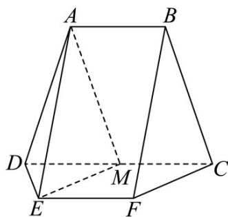

<!-- question-source:start -->
1. (2024·全国甲卷·高考真题) 如图, $AB // CD, CD // EF$ , $AB = DE = EF = CF = 2$ ,

$CD = 4, AD = BC = \sqrt{10}$ ， $AE = 2\sqrt{3}, M$ 为 $CD$ 的中点.

<!-- question-source:end -->

![[高中/真题/按题型分类/专题21 立体几何大题综合/考点02_空间中的垂直关系_第一问_/真题/answers/Q00035851A1.md]]
