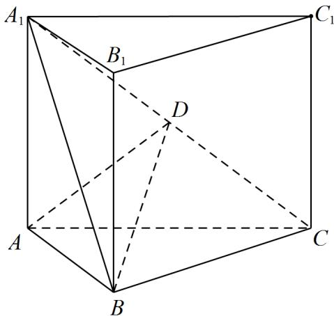

<!-- question-source:start -->
4.（2022·全国新I卷·高考真题）如图，直三棱柱 $ABC - A_{1}B_{1}C_{1}$ 的体积为4， $\triangle A_{1}BC$ 的面积为 $2\sqrt{2}$

(1)求 A 到平面 $A_{1}BC$ 的距离；

(2)设 $D$ 为 $A_{1}C$ 的中点， $AA_{1} = AB$ ，平面 $A_{1}BC \perp$ 平面 $ABB_{1}A_{1}$ ，求二面角 $A - BD - C$ 的正弦值.
<!-- question-source:end -->

![[高中/真题/按题型分类/专题21 立体几何大题综合/考点02_空间中的垂直关系_第一问_/真题/answers/Q00035854A1.md]]
