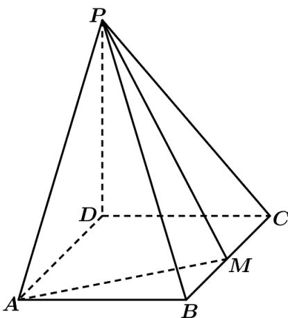

<!-- question-source:start -->
5.（2021·全国乙卷·高考真题）如图，四棱锥 $P - ABCD$ 的底面是矩形， $PD \perp$ 底面 $ABCD$ ， $PD = DC = 1$ ， $M$ 为 $BC$ 的中点，且 $PB \perp AM$ 。

(1) 求 BC ;

(2) 求二面角 A - PM - B 的正弦值.
<!-- question-source:end -->

![[高中/真题/按题型分类/专题21 立体几何大题综合/考点02_空间中的垂直关系_第一问_/真题/answers/Q00035855A1.md]]
