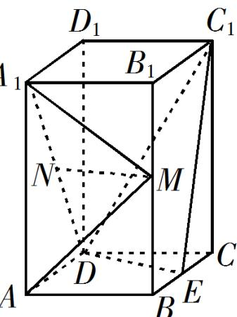

<!-- question-source:start -->
6. (2019·全国·高考真题) 如图，直四棱柱 $ABCD-A_{1}B_{1}C_{1}D_{1}$ 的底面是菱形， $AA_{1}=4$ ，AB=2， $\angle BAD=60^{\circ}$ ，E，M，N 分别是 BC，BB $_{1}$ ，A $_{1}$ D 的中点。

(1) 证明： $MN^{\parallel}$ 平面 $C_{1}DE$ ;

(2) 求点 C 到平面 $C_{1}DE$ 的距离.
<!-- question-source:end -->

![[高中/真题/按题型分类/专题21 立体几何大题综合/考点02_空间中的垂直关系_第一问_/真题/answers/Q00035856A1.md]]
