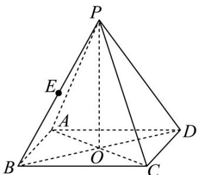

<!-- question-source:start -->
1. (2024·上海·高考真题) 如图为正四棱锥 $P - ABCD, O$ 为底面 $ABCD$ 的中心.

(1)若 $AP = 5, AD = 3\sqrt{2}$ ，求 $\triangle POA$ 绕 $PO$ 旋转一周形成的几何体的体积；

(2)若 $AP = AD, E$ 为 $PB$ 的中点，求直线 $BD$ 与平面 $AEC$ 所成角的大小.
<!-- question-source:end -->

![[高中/真题/按题型分类/专题21 立体几何大题综合/考点02_空间中的垂直关系_第一问_/真题/answers/Q00035858A1.md]]
