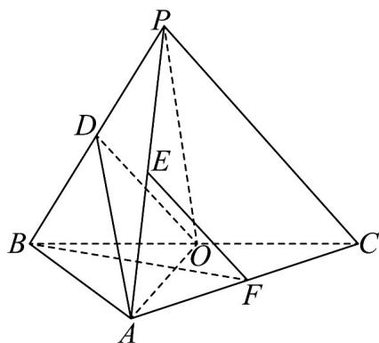

<!-- question-source:start -->
2．（2023·全国乙卷·高考真题）如图，在三棱锥P-ABC中， $AB \perp BC$ ，AB=2， $BC=2\sqrt{2}$ ， $PB = PC = \sqrt{6}$ ，BP,AP,BC 的中点分别为 D,E,O ，点 F 在 AC 上， $BF \perp AO$ ．

<!-- question-source:end -->

![[高中/真题/按题型分类/专题21 立体几何大题综合/考点02_空间中的垂直关系_第一问_/真题/answers/Q00035859A1.md]]
