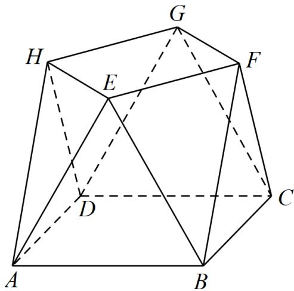

<!-- question-source:start -->
3．（2022·全国甲卷·高考真题）小明同学参加综合实践活动，设计了一个封闭的包装盒，包装盒如图所示：底面 ABCD 是边长为 8（单位：cm）的正方形， $\triangle EAB, \triangle FBC, \triangle GCD, \triangle HDA$ 均为正三角形，且它们所在的平面都与平面 ABCD 垂直．

(1)证明： $EF \parallel$ 平面ABCD；

(2)求该包装盒的容积（不计包装盒材料的厚度）.
<!-- question-source:end -->

![[高中/真题/按题型分类/专题21 立体几何大题综合/考点02_空间中的垂直关系_第一问_/真题/answers/Q00035860A1.md]]
