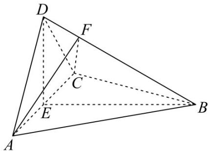

<!-- question-source:start -->
4．（2022·全国乙卷·高考真题）如图，四面体 ABCD 中， $AD \perp CD, AD = CD, \angle ADB = \angle BDC$ ，E 为 AC 的中点．

<!-- question-source:end -->

![[高中/真题/按题型分类/专题21 立体几何大题综合/考点02_空间中的垂直关系_第一问_/真题/answers/Q00035861A1.md]]
