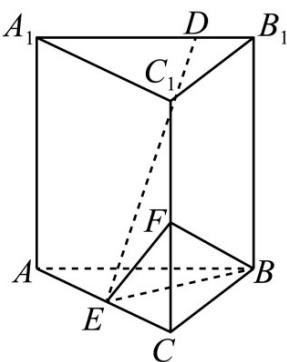

<!-- question-source:start -->
6.（2021·全国甲卷·高考真题）已知直三棱柱 $ABC-A_{1}B_{1}C_{1}$ 中，侧面 $AA_{1}B_{1}B$ 为正方形，AB=BC=2，E，F分别为AC和 $CC_{1}$ 的中点， $BF\perp A_{1}B_{1}$ .

(1) 求三棱锥 F - EBC 的体积；

(2) 已知 D 为棱 $A_{1}B_{1}$ 上的点，证明： $BF \perp DE \cdot$
<!-- question-source:end -->

![[高中/真题/按题型分类/专题21 立体几何大题综合/考点02_空间中的垂直关系_第一问_/真题/answers/Q00035863A1.md]]
