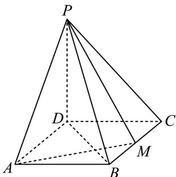

<!-- question-source:start -->
7．（2021·全国乙卷·高考真题）如图，四棱锥 P-ABCD 的底面是矩形， $PD \perp$ 底面 ABCD，M 为 BC 的中点，且 $PB \perp AM$ ．

(1) 证明：平面 $PAM \perp$ 平面 $PBD$ ；

(2) 若 $PD = DC = 1$ ，求四棱锥 $P - ABCD$ 的体积。
<!-- question-source:end -->

![[高中/真题/按题型分类/专题21 立体几何大题综合/考点02_空间中的垂直关系_第一问_/真题/answers/Q00035864A1.md]]
