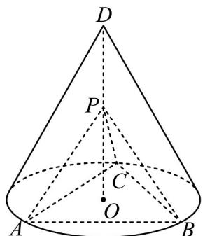

<!-- question-source:start -->
8.（2020·全国·高考真题）如图，D为圆锥的顶点，O是圆锥底面的圆心， $\triangle ABC$ 是底面的内接正三角形，P为DO上一点， $\angle APC=90^{\circ}$ .

<!-- question-source:end -->

![[高中/真题/按题型分类/专题21 立体几何大题综合/考点02_空间中的垂直关系_第一问_/真题/answers/Q00035865A1.md]]
