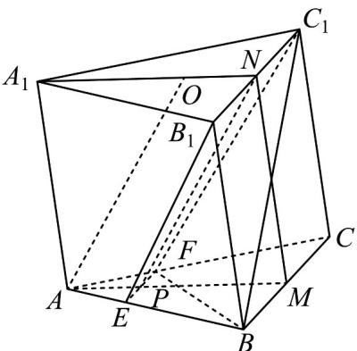

<!-- question-source:start -->
9．（2020·全国·高考真题）如图，已知三棱柱 $ABC-A_{1}B_{1}C_{1}$ 的底面是正三角形，侧面 $BB_{1}C_{1}C$ 是矩形，M，N 分别为 BC， $B_{1}C_{1}$ 的中点，P 为 AM 上一点．过 $B_{1}C_{1}$ 和 P 的平面交 AB 于 E，交 AC 于 F．

(1) 证明： $AA_{1}//MN$ ，且平面 $A_{1}AMN\perp$ 平面 $EB_{1}C_{1}F$ ；

(2) 设 $O$ 为 $\triangle A_{1}B_{1}C_{1}$ 的中心，若 $AO = AB = 6$ ， $AO //$ 平面 $EB_{1}C_{1}F$ ，且 $z^{MPN} = \frac{\pi}{3}$ ，求四棱锥 $B - EB_{1}C_{1}F$ 的体积。
<!-- question-source:end -->

![[高中/真题/按题型分类/专题21 立体几何大题综合/考点02_空间中的垂直关系_第一问_/真题/answers/Q00035866A1.md]]
