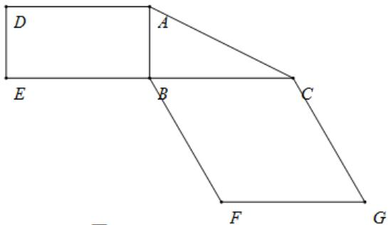
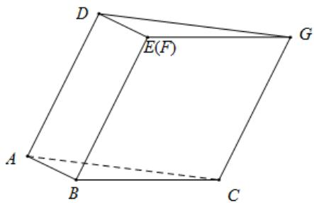

<!-- question-source:start -->
10．（2019·全国·高考真题）图1是由矩形 $ADEB, Rt\Delta ABC$ 和菱形BFGC组成的一个平面图形，其中AB=1, BE=BF=2， $\angle FBC=60^{\circ}$ ，将其沿AB, BC折起使得BE与BF重合，连结DG，如图2.

(1) 证明图2中的 $A, C, G, D$ 四点共面，且平面 $ABC \perp$ 平面 $BCGE$ ；

(2) 求图 2 中的四边形 ACGD 的面积.

图1

图2
<!-- question-source:end -->

![[高中/真题/按题型分类/专题21 立体几何大题综合/考点02_空间中的垂直关系_第一问_/真题/answers/Q00035867A1.md]]
