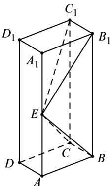

<!-- question-source:start -->
11．（2019·全国·高考真题）如图，长方体 $ABCD-A_{l}B_{l}C_{l}D_{l}$ 的底面ABCD是正方形，点E在棱 $AA_{l}$ 上， $BE\perp EC_{l}$

(1) 证明： $BE^{\perp}$ 平面 $EB_{l}C_{l}$ ;

(2) 若 $AE = A_{1}E$ , $AB = 3$ ，求四棱锥 $E - BB_{1}C_{1}C$ 的体积.
<!-- question-source:end -->

![[高中/真题/按题型分类/专题21 立体几何大题综合/考点02_空间中的垂直关系_第一问_/真题/answers/Q00035868A1.md]]
