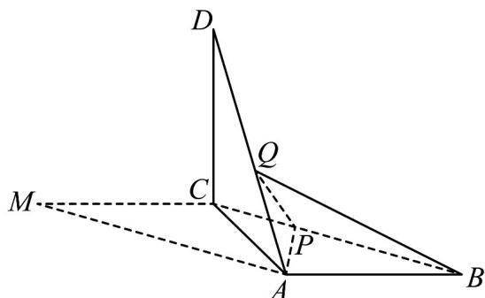

<!-- question-source:start -->
12．（2018·全国·高考真题）如图，在平行四边形ABCM中， $AB = AC = 3$ ， $\angle ACM = 90^{\circ}$ ，以AC为折痕将△ACM折起，使点M到达点D的位置，且 $AB \perp DA$ 。

(1) 证明：平面 $ACD \perp$ 平面 ABC；

(2) Q 为线段 AD 上一点，P 为线段 BC 上一点，且 $BP = DQ = \frac{2}{3} DA$ ，求三棱锥 Q - ABP 的体积。

<!-- question-source:end -->

![[高中/真题/按题型分类/专题21 立体几何大题综合/考点02_空间中的垂直关系_第一问_/真题/answers/Q00035869A1.md]]
