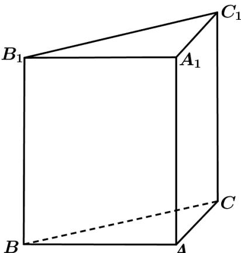

<!-- question-source:start -->
13．（2017·上海高考真题）如图，直三棱柱 $ABC-A_{1}B_{1}C_{1}$ 的底面为直角三角形，两直角边AB和AC的长分别为4和2，侧棱 $AA_{1}$ 的长为5.

(1) 求三棱柱 $ABC - A_{1}B_{1}C_{1}$ 的体积；

(2) 设 M 是 BC 中点，求直线 $A_{1}M$ 与平面 ABC 所成角的大小.

<!-- question-source:end -->

![[高中/真题/按题型分类/专题21 立体几何大题综合/考点02_空间中的垂直关系_第一问_/真题/answers/Q00035870A1.md]]
