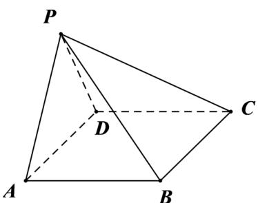

<!-- question-source:start -->
14．（2017·全国·高考真题）如图，在四棱锥 P-ABCD 中， $AB\parallel CD$ ，且 $\angle BAP = \angle CDP = 90^{\circ}$

(1) 证明：平面 $PAB \perp$ 平面 $PAD$ ；

(2) 若 $PA = PD = AB = DC$ ， $\angle APD = 90^\circ$ ，且四棱锥 $P - ABCD$ 的体积为 $\frac{8}{3}$ ，求该四棱锥的侧面积。
<!-- question-source:end -->

![[高中/真题/按题型分类/专题21 立体几何大题综合/考点02_空间中的垂直关系_第一问_/真题/answers/Q00035871A1.md]]
