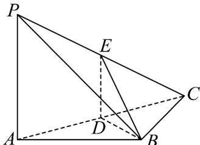

<!-- question-source:start -->
15. (2017·北京·高考真题) 如图，在三棱锥 $P - ABC$ 中， $PA \perp AB$ ， $PA \perp BC$ ， $AB \perp BC$ ， $PA = AB = BC = 2$

$D$ 为线段 $AC$ 的中点， $E$ 为线段 $PC$ 上一点

(1)求证： $PA \perp BD$ ；

(2)求证：平面 $BDE^{\perp}$ 平面 $PAC$ ；

(3)当 $PA^{\parallel}$ 平面 $BDE$ 时，求三棱锥 $E - BCD$ 的体积.
<!-- question-source:end -->

![[高中/真题/按题型分类/专题21 立体几何大题综合/考点02_空间中的垂直关系_第一问_/真题/answers/Q00035872A1.md]]
