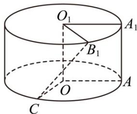

<!-- question-source:start -->
19. (2016·上海·高考真题) 将边长为 1 的正方形 $AA_{1}O_{1}O$ (及其内部) 绕 $OO_{1}$ 旋转一周形成圆柱, 如图, $A_{1}C$ 长为 $\frac{2\pi}{3}$ , $A_{1}B_{1}$ 长为 $\frac{\pi}{3}$ , 其中 $B_{1}$ 与 $C$ 在平面 $AA_{1}O_{1}O$ 的同侧.

(1)求三棱锥 $C - O_{1}A_{1}B_{1}$ 的体积；

(2)求异面直线 $B_{1}C$ 与 $AA_{1}$ 所成的角的大小.
<!-- question-source:end -->

![[高中/真题/按题型分类/专题21 立体几何大题综合/考点02_空间中的垂直关系_第一问_/真题/answers/Q00035876A1.md]]
