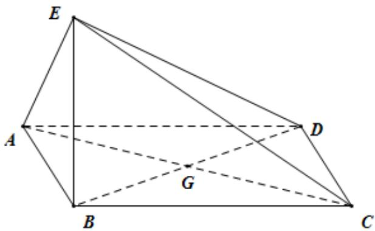

<!-- question-source:start -->
24．（2015·全国·高考真题）如图四边形ABCD为菱形，G为AC与BD交点，BE⊥平面ABCD

(1) 证明：平面 $AEC \perp$ 平面 $BED$ ；

(Ⅱ) 若 $\angle ABC = 120^{\circ}$ ， $AE \perp EC$ ，三棱锥 $E - ACD$ 的体积为 $\frac{\sqrt{6}}{3}$ ，求该三棱锥的侧面积.

<!-- question-source:end -->

![[高中/真题/按题型分类/专题21 立体几何大题综合/考点02_空间中的垂直关系_第一问_/真题/answers/Q00035881A1.md]]
