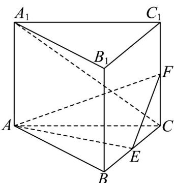

<!-- question-source:start -->
25. (2015·湖南·高考真题) 如图, 直三棱柱 $ABC - A_{1}B_{1}C_{1}$ 的底面是边长为 2 的正三角形, $E, F$ 分别是 $BC, CC_{1}$ 的中点.

<!-- question-source:end -->

![[高中/真题/按题型分类/专题21 立体几何大题综合/考点02_空间中的垂直关系_第一问_/真题/answers/Q00035882A1.md]]
