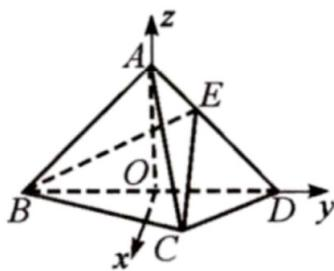
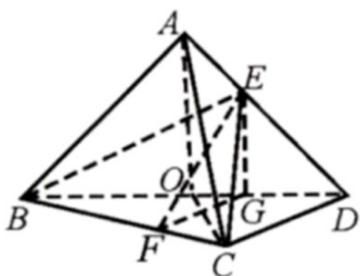
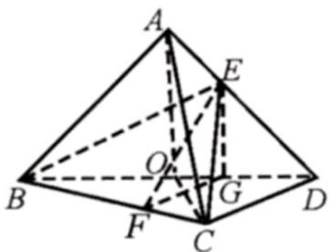

> [!faq]- 《专题21 立体几何大题综合》真题解析
>
> > [!success]- **【答案】** 详见解析
>
> > [!note]- **【分析】**
> > $^{(1)}$ 由题意首先证得线面垂直，然后利用线面垂直的定义证明线线垂直即可；
> >
> > (2)方法二：利用几何关系找到二面角的平面角，然后结合相关的几何特征计算三棱锥的体积即可·
>
> > [!note]- **【解析】**
> > （1）因为 AB = AD，O 是 BD 中点，所以 $OA \perp BD$ ，
> > 因为 $OA \subset$ 平面 ABD ，平面 $ABD \perp$ 平面 BCD ，
> > 且平面 $ABD \cap$ 平面 $BCD = BD$ ，所以 $OA \perp$ 平面 $BCD$ 。
> > 因为 $CD \subset$ 平面 $BCD$ ，所以 $OA \perp CD$ .
> > (2) [方法一]：通性通法—坐标法
> > 如图所示，以 O 为坐标原点，OA 为 z 轴，OD 为 y 轴，垂直 OD 且过 O 的直线为 x 轴，建立空间直角坐标系 O - xyz ，
> > 则 $C(\frac{\sqrt{3}}{2},\frac{1}{2},0),D(0,1,0),B(0,-1,0)$ ，设 $A(0,0,m),E(0,\frac{1}{3},\frac{2}{3}m)$ ，
> > 
> > 所以 $\overrightarrow{EB}=(0,-\frac{4}{3},-\frac{2}{3}m),\overrightarrow{BC}=(\frac{\sqrt{3}}{2},\frac{3}{2},0)$
> > 设 $\stackrel{\Gamma}{n}=(x,y,z)$ 为平面 EBC 的法向量，
> > 则由 $\left\{ \begin{array}{l}EB \cdot n = 0 \\ BC \cdot n = 0 \end{array} \right.$ 可求得平面 $EBC$ 的一个法向量为 $n = (-\sqrt{3}, 1, -\frac{2}{m})$
> > 又平面 $BCD$ 的一个法向量为 $\overline{OA} = (0,0,m)$
> > 所以 $\cos\left\langle\vec{n},OA\right\rangle=\left|\frac{-2}{m\cdot\sqrt{4+\frac{4}{m^{2}}}}\right|=\frac{\sqrt{2}}{2}$ ，解得 m=1
> > 又点 $C$ 到平面 $_{ABD}$ 的距离为 $\frac{\sqrt{3}}{2}$ ，所以 $V_{A-BCD} = V_{C-ABD} = \frac{1}{3} \times \frac{1}{2} \times 2 \times 1 \times \frac{\sqrt{3}}{2} = \frac{\sqrt{3}}{6}$ ，
> > 所以三棱锥 $A - BCD$ 的体积为 $\frac{\sqrt{3}}{6}$
> > [方法二]【最优解】：作出二面角的平面角
> > 如图所示，作 $EG \perp BD$ ，垂足为点G。
> > 作 $GF \perp BC$ ，垂足为点 $F$ ，连结 $EF$ ，则 $OA \parallel EG$ 。
> > 
> > 因为 $OA \perp$ 平面 $BCD$ ，所以 $EG \perp$ 平面 $BCD$
> > $\angle EFG$ 为二面角 $E - BC - D$ 的平面角.
> > 因为 $\angle EFG = 45^{\circ}$ ，所以 $EG = FG$
> > 由已知得 $OB = OD = 1$ ，故 $OB = OC = 1$
> > 又 $\angle OBC = \angle OCB = 30^{\circ}$ ，所以 $BC = \sqrt{3}$
> > 因为 $GD = \frac{2}{3}$ , GB = $\frac{4}{3}$ , FG = $\frac{2}{3}$ CD = $\frac{2}{3}$ , EG = $\frac{2}{3}$ , OA = 1,
> > $$
> > V _ {A - B C D} = \frac {1}{3} S _ {\triangle B C D} \times O A = \frac {1}{3} \times 2 S _ {\triangle B O C} \times O A = \frac {1}{3} \times 2 \times \left(\frac {1}{2} \times \frac {\sqrt {3}}{2} \times 1 \times 1\right) \times 1 = \frac {\sqrt {3}}{6}
> > $$
> > [方法三]：三面角公式
> > 考虑三面角 B-EDC，记 $\angle EBD$ 为 $\alpha$ ， $\angle EBC$ 为 $\beta$ ， $\angle DBC = 30^{\circ}$ ，
> > 记二面角 $E - BC - D$ 为 $\theta$ .据题意，得 $\theta = 45^{\circ}$
> > 对 $\beta$ 使用三面角的余弦公式，可得 $\cos\beta=\cos\alpha\cdot\cos30^{\circ}$
> > 化简可得 $\cos\beta=\frac{\sqrt{3}}{2}\cos\alpha$ . ①
> > 使用三面角的正弦公式，可得 $\sin \beta = \frac{\sin\alpha}{\sin\theta}$ ，化简可得 $\sin \beta = \sqrt{2}\sin \alpha$ ②
> > 将①②两式平方后相加，可得 $\frac{3}{4}\cos^2\alpha + 2\sin^2\alpha = 1$
> > 由此得 $\sin^2\alpha = \frac{1}{4}\cos^2\alpha$ ，从而可得 $\tan \alpha = \pm \frac{1}{2}$
> > 
> > 如图可知 $\alpha\in(0,\frac{\pi}{2})$ ，即有 $\tan\alpha=\frac{1}{2}$
> > 根据三角形相似知，点 G 为 OD 的三等分点，即可得 $BG = \frac{4}{3}$
> > 结合 $\alpha$ 的正切值，
> > 可得 $EG = \frac{2}{3}, OA = 1$ 从而可得三棱锥 $A - BCD$ 的体积为 $\frac{\sqrt{3}}{6}$
> > 【整体点评】(2)方法一：建立空间直角坐标系是解析几何中常用的方法，是此类题的通性通法，其好处在于将几何问题代数化，适合于复杂图形的处理；
> > 方法二：找到二面角的平面角是立体几何的基本功，在找出二面角的同时可以对几何体的几何特征有更加深刻的认识，该法为本题的最优解·
> > 方法三：三面角公式是一个优美的公式，在很多题目的解析中灵活使用三面角公式可以使得问题更加简单、直观、迅速·
