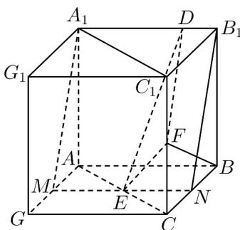
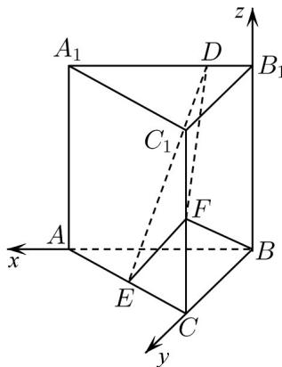
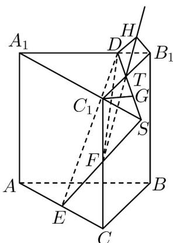
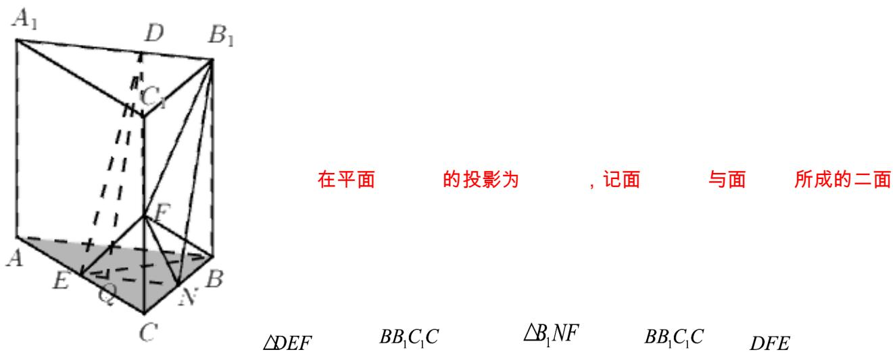

> [!faq]- 《专题21 立体几何大题综合》真题解析
>
> > [!success]- **【答案】** 详见解析
>
> > [!note]- **【分析】**
> > （1）方法二：通过已知条件，确定三条互相垂直的直线，建立合适的空间直角坐标系，借助空间向量证明线线垂直；
> >
> > (2) 方法一：建立空间直角坐标系，利用空间向量求出二面角的平面角的余弦值最大，进而可以确定出答案；
>
> > [!note]- **【解析】**
> > （1）[方法一]：几何法
> > 因为 $BF \perp A_{1}B_{1}, A_{1}B_{1} // AB$ ，所以 $BF \perp AB$
> > 又因为 $AB \perp BB_{1}$ ， $BF \cap BB_{1} = B$ ，所以 $AB \perp$ 平面 $BCC_{1}B_{1}$ 。又因为 $AB = BC = 2$ ，构造正方体 $ABCG - A_{1}B_{1}C_{1}G_{1}$ ，如图所示，
> > 
> > 过 $E$ 作 $AB$ 的平行线分别与 $AG$ , $BC$ 交于其中点 $M, N$ , 连接 $A_{1}M, B_{1}N$
> > 因为 E, F 分别为 AC 和 $CC_{1}$ 的中点，所以 N 是 BC 的中点，
> > 易证 $\mathrm{Rt}\triangle BCF\cong \mathrm{Rt}\triangle B_1BN$ ，则 $\angle CBF = \angle BB_{1}N$
> > 又因为 $\angle BB_{1}N + \angle B_{1}NB = 90^{\circ}$ ，所以 $\angle CBF + \angle B_{1}NB = 90^{\circ}, BF\perp B_{1}N$
> > 又因为 $BF \perp A_{1}B_{1}, B_{1}N \cap A_{1}B_{1} = B_{1}$ ，所以 $BF \perp$ 平面 $A_{1}MNB_{1}$
> > 又因为 $ED \subset$ 平面 $A_{1}MNB_{1}$ ，所以 $BF \perp DE$ 。
> > [方法二] 【最优解】：向量法
> > 因为三棱柱 $ABC - A_{1}B_{1}C_{1}$ 是直三棱柱，∴ $BB_{1} \perp$ 底面 ABC，∴ $BB_{1} \perp AB$
> > $\because A_{1}B_{1}//AB, BF \perp A_{1}B_{1}, \therefore BF \perp AB$ ，又 $BB_{1} \cap BF = B$ ， $\therefore AB \perp$ 平面 $BCC_{1}B_{1}$ 。所以 $BA, BC, BB_{1}$ 两两垂直。以 $B$ 为坐标原点，分别以 $BA, BC, BB_{1}$ 所在直线为 $x, y, z$ 轴建立空间直角坐标系，如图。
> > 
> > $$
> > \therefore B (0, 0, 0), A (2, 0, 0), C (0, 2, 0), B _ {1} (0, 0, 2), A _ {1} (2, 0, 2), C _ {1} (0, 2, 2)
> > $$
> > $E(1,1,0),F(0,2,1)$
> > 由题设 $D(a,0,2)$ （ $0\leq a\leq 2$ ）
> > 因为 $BF = (0, 2, 1)$ , $DE = (1 - a, 1, -2)$
> > 所以 $BF \cdot DE = 0 \times (1 - a) + 2 \times 1 + 1 \times (-2) = 0$ ，所以 $BF \perp DE$
> > [方法三]：因为 $BF \perp A_1B_1$ ， $A_1B_1 // AB$ ，所以 $BF \perp AB$ ，故 $BF \cdot A_1B_1 = 0$ ， $BF \cdot AB = 0$ ，所以 $BF \cdot ED = BF \cdot (EB + BB_1 + B_1D) = BF \cdot B_1D + BF \cdot (EB + BB_1) = BF \cdot EB + BF \cdot BB_1$
> > $$
> > = \stackrel {\square \square \square} {B F} \left(- \frac {1}{2} \stackrel {\square \square \square} {B A} - \frac {1}{2} \stackrel {\square \square \square} {B C}\right) + \stackrel {\square \square \square} {B F} \cdot \stackrel {\square \square \square} {B B _ {1}} = - \frac {1}{2} \stackrel {\square \square \square} {B F} \cdot \stackrel {\square \square \square} {B A} - \frac {1}{2} \stackrel {\square \square \square} {B F} \cdot \stackrel {\square \square \square} {B C} + \stackrel {\square \square \square} {B F} \cdot \stackrel {\square \square \square} {B B _ {1}} = - \frac {1}{2} \stackrel {\square \square \square} {B F} \cdot \stackrel {\square \square \square} {B C} + \stackrel {\square \square \square} {B F} \cdot \stackrel {\square \square \square} {B B _ {1}}
> > $$
> > $= -\frac{1}{2}\left|\overline{BF}\right|\cdot \left|\overline{BC}\right|\cos \angle FBC + \left|\overline{BF}\right|\cdot \left|\overline{BB}_{1}\right|\cos \angle FBB_{1} = -\frac{1}{2}\times \sqrt{5}\times 2\times \frac{2}{\sqrt{5}} +\sqrt{5}\times 2\times \frac{1}{\sqrt{5}} = 0$ ，所以 $BF\perp ED$
> > (2) [方法一]【最优解】：向量法
> > 设平面 DFE 的法向量为 $m = (x, y, z)$ ,
> > 因为 $EF = (-1, 1, 1)$ , $DE = (1 - a, 1, -2)$ ,
> > 所以 $\left\{ \begin{array}{l} m \cdot \overrightarrow{EF} = 0 \\ m \cdot DE = 0 \end{array} \right.$ ，即 $\left\{ \begin{array}{l} -x + y + z = 0 \\ (1 - a)x + y - 2z = 0 \end{array} \right.$
> > 令 $z = 2 - a$ ，则 $m = (3,1 + a,2 - a)$
> > 因为平面 $BCC_{1}B_{1}$ 的法向量为 $BA=(2,0,0)$
> > 设平面 $BCC_{1}B_{1}$ 与平面DEF的二面角的平面角为 $\theta$
> > $$
> > \left| \cos \theta \right| = \frac {\left| m \cdot \overrightarrow {B A} \right|}{\left| m \right| \cdot \left| B A \right|} = \frac {6}{2 \times \sqrt {2 a ^ {2} - 2 a + 1 4}} = \frac {3}{\sqrt {2 a ^ {2} - 2 a + 1 4}}
> > $$
> > 当 $a = \frac{1}{2}$ 时， $2a^2 - 2a + 14$ 取最小值为 $\frac{27}{2}$
> > 此时 $\cos\theta$ 取最大值为 $\frac{3}{\sqrt{\frac{27}{2}}}=\frac{\sqrt{6}}{3}$
> > 所以 $\left(\sin \theta\right)_{\min} = \sqrt{1 - \left(\frac{\sqrt{6}}{3}\right)^2} = \frac{\sqrt{3}}{3}$ ，此时 $B_{1}D = \frac{1}{2}$ 。
> > [方法二]：几何法
> > 如图所示，延长 $EF$ 交 $A_{1}C_{1}$ 的延长线于点 $S$ ，联结 $DS$ 交 $B_{1}C_{1}$ 于点 $T$ ，则平面 $DFE\cap$ 平面 $BB_{1}C_{1}C = FT$
> > 
> > 作 $B_{1}H \perp FT$ ，垂足为 $H$ ，因为 $DB_{1} \perp$ 平面 $BB_{1}C_{1}C$ ，联结 $DH$ ，则 $\angle DHB_{1}$ 为平面 $BB_{1}C_{1}C$ 与平面 $DFE$ 所成二面角的平面角。
> > 设 $B_{1}D = t, t \in [0,2], B_{1}T = s$ ，过 $C_{1}$ 作 $C_{1}G // A_{1}B_{1}$ 交 $DS$ 于点 $G$ 。
> > 
> > 由 $\frac{C_1S}{SA_1} = \frac{1}{3} = \frac{C_1G}{A_1D}$ 得 $C_1G = \frac{1}{3}(2 - t)$
> > 又 $\frac{B_1D}{C_1G} = \frac{B_1T}{C_1T}$ ，即 $\frac{t}{\frac{1}{3}(2 - t)} = \frac{s}{2 - s}$ ，所以 $s = \frac{3t}{t + 1}$
> > 又 $\frac{B_1H}{C_1F} = \frac{B_1T}{FT}$ ，即 $\frac{B_1H}{1} = \frac{s}{\sqrt{1 + (2 - s)^2}}$ ，所以 $B_{1}H = \frac{s}{\sqrt{1 + (2 - s)^2}}$
> > 所以 $DH = \sqrt{B_1H^2 + B_1D^2} = \sqrt{\frac{s^2}{1 + (2 - s)^2} + t^2} = \sqrt{\frac{9t^2}{2t^2 - 2t + 5} + t^2}$
> > 则 $\sin \angle DHB_{1} = \frac{B_{1}D}{DH} = \frac{t}{\sqrt{\frac{9t^{2}}{2t^{2} - 2t + 5} + t^{2}}} = \frac{1}{\sqrt{\frac{9}{2\left(t - \frac{1}{2}\right)^{2} + \frac{9}{2}}} + 1}$
> > 所以，当 $t = \frac{1}{2}$ 时， $\left(\sin \angle DHB_1\right)_{\min} = \frac{\sqrt{3}}{3}$
> > [方法三]：投影法
> > 如图，联结 $FB_{1},FN$
> > 角的平面角为 $\theta$ ，则 $\cos \theta = \frac{S_{\triangle B_1NF}}{S_{\triangle DEF}}$
> > 设 $B_{1}D = t(0\leq t\leq 2)$ ，在 $\mathrm{Rt}\triangle DB_1F$ 中， $DF = \sqrt{B_1D^2 + B_1F^2} = \sqrt{t^2 + 5}$
> > 在 Rt△ECF 中， $EF = \sqrt{EC^{2} + FC^{2}} = \sqrt{3}$ ，过 D 作 $B_{1}N$ 的平行线交 EN 于点 Q。
> > 在 Rt△ DEQ 中， $DE = \sqrt{QD^{2} + EQ^{2}} = \sqrt{5 + (1 - t)^{2}}$
> > 在 $\triangle DEF$ 中，由余弦定理得 $\cos \angle DFE = \frac{DF^2 + EF^2 - DE^2}{2DF\cdot EF} = \frac{\sqrt{3t^2 + 15}(t + 1)}{3(t^2 + 5)}$ ， $\sin \angle DFE = \sqrt{\frac{2t^2 - 2t + 14}{3(t^2 + 5)}}$ ， $S_{\triangle DFE} = \frac{1}{2} DF\cdot EF\sin \angle DFE = \frac{1}{2}\sqrt{2t^2 - 2t + 14}$ ， $S_{\triangle B_1NF} = \frac{3}{2},$ $\cos \theta = \frac{S_{\triangle B_1NF}}{S_{\triangle DFE}} = \frac{3}{\sqrt{2t^2 - 2t + 14}}$ ， $\sin \theta = \sqrt{1 - \frac{9}{2(t^2 - t + 7)}}$
> > 当 $t = \frac{1}{2}$ ，即 $B_{1}D = \frac{1}{2}$ ，面 $BB_{1}C_{1}C$ 与面 $DFE$ 所成的二面角的正弦值最小，最小值为 $\frac{\sqrt{3}}{3}$
> > 【整体点评】第一问，方法一为常规方法，不过这道题常规方法较为复杂，方法二建立合适的空间直角坐标系，借助空间向量求解是最简单，也是最优解；方法三利用空间向量加减法则及数量积的定义运算进行证明不常用，不过这道题用这种方法过程也很简单，可以开拓学生的思维·
> > 第二问：方法一建立空间直角坐标系，利用空间向量求出二面角的平面角是最常规的方法，也是最优方法；方法二：利用空间线面关系找到，面 $BB_{1}C_{1}C$ 与面DFE所成的二面角，并求出其正弦值的最小值，不是很容易找到；方法三：利用面DFE在面 $BB_{1}C_{1}C$ 上的投影三角形的面积与 $\triangle DFE$ 面积之比即为面 $BB_{1}C_{1}C$ 与面DFE所成的二面角的余弦值，求出余弦值的最小值，进而求出二面角的正弦值最小，非常好的方法，开阔学生的思维。
