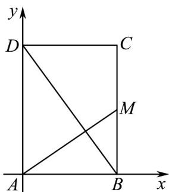
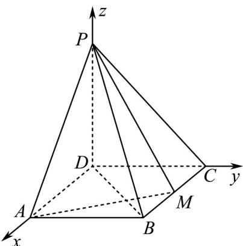

> [!faq]- 《专题21 立体几何大题综合》真题解析
>
> > [!success]- **【答案】** 详见解析
>
> > [!note]- **【分析】**
> > （1）由 $PD \perp$ 底面ABCD可得 $PD \perp AM$ ，又 $PB \perp AM$ ，由线面垂直的判定定理可得 $AM \perp$ 平面PBD，再根据面面垂直的判定定理即可证出平面 $PAM \perp$ 平面PBD；
> >
> > (2) 由 (1) 可知， $AM \perp BD$ ，由平面知识可知， $\triangle DAB \sim \triangle ABM$ ，由相似比可求出 AD，再根据四棱锥 P-ABCD 的体积公式即可求出。
>
> > [!note]- **【解析】**
> > （1）因为 $PD \perp$ 底面 ABCD， $AM \subset$ 平面 ABCD，
> > 所以 $PD \perp AM$ ，
> > 又 $PB \perp AM$ ， $PB \cap PD = P$
> > 所以 $AM \perp$ 平面 PBD ，
> > 而 $AM \subset$ 平面 PAM ，
> > 所以平面 $PAM \perp$ 平面 $PBD$ .
> > (2) [方法一]: 相似三角形法
> > 由 $(1)$ 可知 $AM \perp BD$ .
> > 于是 $\triangle ABD \sim \triangle BMA$ ，故 $\frac{AD}{AB} = \frac{AB}{BM}$ 。
> > 因为 $BM = \frac{1}{2} BC, AD = BC, AB = 1$ ，所以 $\frac{1}{2} BC^2 = 1$ ，即 $BC = \sqrt{2}$ 。
> > 故四棱锥 P-ABCD 的体积 $V=\frac{1}{3}AB\cdot BC\cdot PD=\frac{\sqrt{2}}{3}$
> > [方法二]：平面直角坐标系垂直垂直法
> > 由（2）知 $AM \perp DB$ ，所以 $k_{AM} \cdot k_{BD} = -1$
> > 建立如图所示的平面直角坐标系，设 $BC = 2a(a > 0)$
> > 
> > 因为 $DC = 1$ ，所以 $A(0,0)$ ， $B(1,0)$ ， $D(0,2a)$ ， $M(1,a)$
> > 从而 $k_{AM} \cdot k_{BD} = \frac{a - 0}{1 - 0} \times \frac{2a - 0}{0 - 1} = a \times (-2a) = -2a^2 = -1$
> > 所以 $a = \frac{\sqrt{2}}{2}$ ，即 $DA = \sqrt{2}$ ．下同方法一·
> > [方法三]【最优解】：空间直角坐标系法
> > 建立如图所示的空间直角坐标系 D - xyz
> > 
> > 设 $|DA|=t$ ，所以 $D(0,0,0)$ ， $C(0,1,0)$ ， $P(0,0,1)$ ， $A(t,0,0)$ ， $B(t,1,0)$
> > 所以 $M\left(\frac{t}{2},1,0\right)$ ， $\overline{PB} = (t,1, - 1)$ ， $\overline{AM} = \left(-\frac{t}{2},1,0\right)$
> > 所以 $\overrightarrow{PB} \cdot \overrightarrow{AM} = t \cdot \left(-\frac{t}{2}\right) + 1 \times 1 + 0 \times (-1) = -\frac{t^2}{2} + 1 = 0$
> > 所以 $t = \sqrt{2}$ ，即 $|DA| = \sqrt{2}$ ．下同方法一·
> > [方法四]：空间向量法
> > 由 $PB \perp AM$ ，得 $\overline{PB} \cdot \overline{AM} = 0$
> > 所以 $(PD + DA + AB) \cdot AM = 0$
> > 即 $PD\cdot AM + DA\cdot AM + AB\cdot AM = 0$
> > 又 $PD \perp$ 底面 ABCD ，AM 在平面 ABCD 内，
> > 因此 $PD \perp AM$ ，所以 $PD \cdot AM = 0$
> > 所以 $DA\cdot AM + AB\cdot AM = 0$
> > 由于四边形 ABCD 是矩形，根据数量积的几何意义，
> > 得 $-\frac{1}{2} |DA|^2 + |AB|^2 = 0$ ，即 $-\frac{1}{2} |BC|^2 + 1 = 0$
> > 所以 $|BC|=\sqrt{2}$ ，即 $BC=\sqrt{2}$ ．下同方法一·
> > 【整体点评】(2)方法一利用相似三角形求出求出矩形的另一个边长，从而求得该四棱锥的体积；
> > 方法二构建平面直角坐标系，利用直线垂直的条件得到矩形的另一个边长，从而求得该四棱锥的体积；
> > 方法三直接利用空间直角坐标系和空间向量的垂直的坐标运算求得矩形的另一个边长，为最常用的通性通法，为最优解；
> > 方法四利用空间向量转化求得矩形的另一边长·
