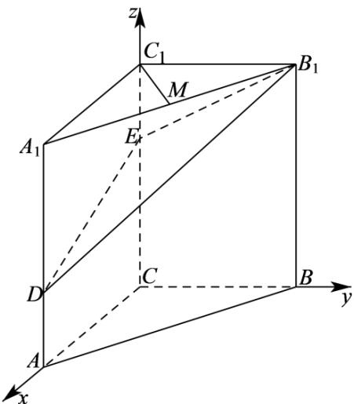

> [!faq]- 《专题21 立体几何大题综合》真题解析
>
> > [!success]- **【答案】** 详见解析
>
> > [!note]- **【分析】**
> > 【分析】以 C 为原点，分别以 $\overline{CA}, \overline{CB}, \overline{CC}_{1}$ 的方向为 x 轴，y 轴，z 轴的正方向建立空间直角坐标系。
> >
> > (Ⅰ) 计算出向量 $\overline{C_{1}M}$ 和 $\overline{B_{1}D}$ 的坐标，得出 $\overline{C_{1}M} \cdot \overline{B_{1}D} = 0$ ，即可证明出 $C_{1}M \perp B_{1}D$ ；
> >
> > （Ⅱ）可知平面 $BB_{1}E$ 的一个法向量为 $\overline{CA}$ ，计算出平面 $B_{1}ED$ 的一个法向量为 $n$ ，利用空间向量法计算出二面角 $B - B_{1}E - D$ 的余弦值，利用同角三角函数的基本关系可求解结果；
> >
> > （III）利用空间向量法可求得直线 AB 与平面 $DB_{1}E$ 所成角的正弦值.
>
> > [!note]- **【解析】**
> > 【详解】依题意，以 C 为原点，分别以 $\overline{CA}$ 、 $\overline{CB}$ 、 $\overline{CC_{1}}$ 的方向为 x 轴、y 轴、z 轴的正方向建立空间直角坐标系（如图），
> > 
> > 可得 $C(0,0,0)$ 、 $A(2,0,0)$ 、 $B(0,2,0)$ 、 $C_{1}(0,0,3)$
> > $A_{1}(2,0,3)$ $B_{1}(0,2,3)$ $D(2,0,1)$ $E(0,0,2)$ $M(1,1,3)$ .
> > (Ⅰ) 依题意， $C_{1}M=(1,1,0)$ ， $B_{1}D=(2,-2,-2)$
> > 从而 $C_{1}M \cdot B_{1}D = 2 - 2 + 0 = 0$ ，所以 $C_{1}M \perp B_{1}D$ ；
> > (Ⅱ) 依题意， $\overline{CA}=(2,0,0)$ 是平面 $BB_{1}E$ 的一个法向量，
> > $$
> > E B _ {1} = (0, 2, 1)
> > $$
> > $$
> > E D = (2, 0, - 1)
> > $$
> > 设 $n=(x,y,z)$ 为平面 $DB_{1}E$ 的法向量，
> > 则 $\left\{ \begin{array}{l} n \cdot EB_{1} = 0 \\ n \cdot ED = 0 \end{array} \right.$ ，即 $\left\{ \begin{array}{l} 2y + z = 0 \\ 2x - z = 0 \end{array} \right.$ ，
> > 不妨设 x=1 ，可得 $n=(1,-1,2)$
> > $\cos < \overrightarrow{CA}, n > = \frac{\overrightarrow{CA} \cdot n}{|\overrightarrow{CA}| \cdot |n|} = \frac{2}{2 \times \sqrt{6}} = \frac{\sqrt{6}}{6}$
> > ∴ $\sin <\overrightarrow{CA}, n>=\sqrt{1-\cos^{2}<\overrightarrow{CA}, n>=\frac{\sqrt{30}}{6}$
> > 所以，二面角 $B - B_{1}E - D$ 的正弦值为 $\frac{\sqrt{30}}{6}$ ；
> > (Ⅲ) 依题意， $AB = (-2, 2, 0)$
> > 由（Ⅱ）知 $n = (1, -1, 2)$ 为平面 $DB_{1}E$ 的一个法向量，于是 $\cos < \overrightarrow{AB}, n > = \frac{\overrightarrow{AB} \cdot n}{|\overrightarrow{AB}| \cdot |n|} = \frac{-4}{2\sqrt{2} \times \sqrt{6}} = -\frac{\sqrt{3}}{3}$ .
> > 所以，直线 $AB$ 与平面 $DB_{1}E$ 所成角的正弦值为 $\frac{\sqrt{3}}{3}$
> > 【点睛】本题考查利用空间向量法证明线线垂直，求二面角和线面角的正弦值，考查推理能力与计算能力，属于中档题·
