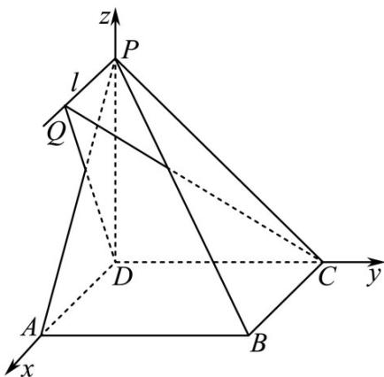
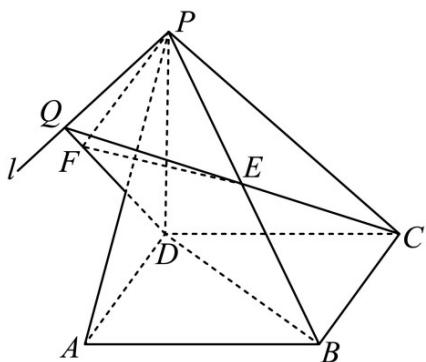
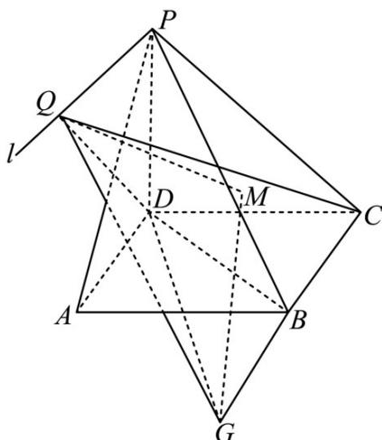

> [!faq]- 《专题21 立体几何大题综合》真题解析
>
> > [!success]- **【答案】** 详见解析
>
> > [!note]- **【分析】**
> > （1）利用线面垂直的判定定理证得 $AD \perp$ 平面 $PDC$ ，利用线面平行的判定定理以及性质定理，证得 $AD // l$ ，从而得到 $l \perp$ 平面 $PDC$ ；
> >
> > (2) 方法一：根据题意，建立相应的空间直角坐标系，得到相应点的坐标，设出点 $Q(m,0,1)$ ，之后求得平面 $QCD$ 的法向量以及向量 $\overline{PB}$ 的坐标，求得 $\left|\cos < n, \overline{PB} >\right|$ 的最大值，即为直线 $PB$ 与平面 $QCD$ 所成角的正弦值的最大值.
>
> > [!note]- **【解析】**
> > （1）证明：
> > 在正方形 ABCD 中， $AD \parallel BC$ ，因为 $AD \notin$ 平面 PBC， $BC \subset$ 平面 PBC，
> > 所以 $AD \parallel$ 平面 PBC ，又因为 $AD \subset$ 平面 PAD ，平面 $PAD \cap$ 平面 PBC = l
> > 所以 $AD \parallel l$ ，因为在四棱锥 P-ABCD 中，底面 ABCD 是正方形，所以 $AD \perp DC, \therefore l \perp DC,$ 且 $PD \perp$ 平面 ABCD，所以 $AD \perp PD, \therefore l \perp PD,$
> > 因为 $CD \cap PD = D$ ，所以 $l \perp$ 平面 $PDC$ 。
> > (2) [方法一] 【最优解】：通性通法
> > 因为 DP, DA, DC 两两垂直，建立空间直角坐标系 D - xyz ，如图所示：
> > 
> > 因为 $PD = AD = 1$ ，设 $D(0,0,0),C(0,1,0),A(1,0,0),P(0,0,1),B(1,1,0)$
> > 设 $Q(m,0,1)$ ，则有 $\overline{DC} = (0,1,0),\overline{DQ} = (m,0,1),\overline{PB} = (1,1, - 1)$
> > 设平面 $QCD$ 的法向量为 $n = (x, y, z)$
> > 则 $\left\{ \begin{array}{l} D C \cdot n = 0 \\ D Q \cdot n = 0 \end{array} \right.$ ，即 $\left\{ \begin{array}{l} y = 0 \\ mx + z = 0 \end{array} \right.$ ，
> > 令 x=1，则 z=-m，所以平面 QCD 的一个法向量为 $n=(1,0,-m)$ ，则
> > $$
> > \cos <   n, P B > = \frac {n \cdot P B}{| n | | P B |} = \frac {1 + 0 + m}{\sqrt {3} \cdot \sqrt {m ^ {2} + 1}}
> > $$
> > 根据直线的方向向量与平面法向量所成角的余弦值的绝对值即为直线与平面所成角的正弦值，所以直线 $PB$
> > 与平面 $QCD$ 所成角的正弦值等于 $\left|\cos < n, PB >\right| = \frac{\left|1 + m\right|}{\sqrt{3} \cdot \sqrt{m^2 + 1}} = \frac{\sqrt{3}}{3} \cdot \sqrt{\frac{1 + 2m + m^2}{m^2 + 1}}$
> > $= \frac{\sqrt{3}}{3}\cdot \sqrt{1 + \frac{2m}{m^2 + 1}}\leq \frac{\sqrt{3}}{3}\cdot \sqrt{1 + \frac{2|m|}{m^2 + 1}}\leq \frac{\sqrt{3}}{3}\cdot \sqrt{1 + 1} = \frac{\sqrt{6}}{3}$ ，当且仅当 $m = 1$ 时取等号，所以直线 $P_B$ 与平面 $QCD$ 所成角的正弦值的最大值为 $\frac{\sqrt{6}}{3}$
> > [方法二]：定义法
> > 如图 2，因为 $l \subset$ 平面 PBC， $Q \in l$ ，所以 $Q \in$ 平面 PBC。
> > 
> > 图2
> > 在平面 $PQC$ 中，设 $PB \cap QC = E$
> > 在平面 PAD 中，过 P 点作 $PF \perp QD$ ，交 QD 于 F，连接 EF
> > 因为 $PD \perp$ 平面 $ABCD, DC \subset$ 平面 $ABCD$ ，所以 $DC \perp PD$
> > 又由 $DC \perp AD, AD \cap PD = D, PD \subset$ 平面 $PAD$ ， $AD \subset$ 平面 $PAD$ ，所以 $DC \perp$ 平面 $PAD$ 。又 $PF \subset$ 平面 $PAD$ ，所以 $DC \perp PF$ 。又由 $PF \perp QD, QD \cap DC = D, QD \subset$ 平面 $QOC, DC \subset$ 平面 $QDC$ ，所以 $PF \perp$ 平面 $QDC$ ，从而 $\angle FEP$ 即为 $PB$ 与平面 $QCD$ 所成角。
> > 设 $PQ = a$ ，在 $\triangle PQD$ 中，易求 $PF = \frac{a}{\sqrt{a^2 + 1}}$
> > 由 $\mathrm{VPQE}$ 与 $\triangle BEC$ 相似，得 $\frac{PE}{EB} = \frac{PQ}{BC} = \frac{a}{1}$ ，可得 $PE = \frac{\sqrt{3}a}{a + 1}$
> > 所以 $\sin\angle FEP=\sqrt{\left(\frac{a+1}{\sqrt{3a^{2}+3}}\right)^{2}}=\sqrt{\frac{1}{3}\left(1+\frac{2a}{a^{2}+1}\right)}\leq\sqrt{\frac{2}{3}}=\frac{\sqrt{6}}{3}$ ，当且仅当 a=1 时等号成立。
> > [方法三]：等体积法
> > 如图 $^{3}$ ，延长CB至G，使得BG=PQ，连接GQ，GD，则PB//QG，过G点作GM⊥平面QDC，交平面QDC于M，连接QM，则∠GQM即为所求.
> > 
> > 图3
> > 设 $PQ = x$ ，在三棱锥 $Q - DCG$ 中， $V_{Q - DCG} = \frac{1}{3} PD \cdot \frac{1}{2} CD \cdot (CB + BG) = \frac{1}{6}(1 + x)$
> > 在三棱锥 G-QDC 中， $V_{G-QDC}=\frac{1}{3}GM\cdot\frac{1}{2}CD\cdot QD=\frac{1}{3}GM\cdot\frac{1}{2}\sqrt{1+x^{2}}$
> > 由 $V_{Q - DCG} = V_{G - QDC}$ 得 $\frac{1}{6} (1 + x) = \frac{1}{3} GM\cdot \frac{1}{2}\sqrt{1 + x^2}$
> > 解得 $GM = \frac{1 + x}{\sqrt{1 + x^2}} = \sqrt{\frac{1 + 2x + x^2}{1 + x^2}} = \sqrt{1 + \frac{2x}{1 + x^2}} \leq \sqrt{2}$
> > 当且仅当 x=1 时等号成立。
> > 在 $Rt^{\triangle}PDB$ 中，易求 $PB = \sqrt{3} = QG$ ，所以直线 $PB$ 与平面 $QCD$ 所成角的正弦值的最大值为 $\sin \angle MQG = \frac{\sqrt{2}}{\sqrt{3}} = \frac{\sqrt{6}}{3}$
> > 【整体点评】（2）方法一：根据题意建立空间直角坐标系，直线 $PB$ 与平面 $QCD$ 所成角的正弦值即为平面 $QCD$ 的法向量 $n$ 与向量 $\overline{PB}$ 的夹角的余弦值的绝对值，即 $\left|\cos < n, \overline{PB} >\right|$ ，再根据基本不等式即可求出，是本题的通性通法，也是最优解；
> > 方法二：利用直线与平面所成角的定义，作出直线 $PB$ 与平面 $QCD$ 所成角，再利用解三角形以及基本不等式即可求出；
> > 方法三：巧妙利用 $PB // QG$ ，将线转移，再利用等体积法求得点面距，利用直线 $PB$ 与平面 $QCD$ 所成角的正弦值即为点面距与线段长度的比值的方法，即可求出。
