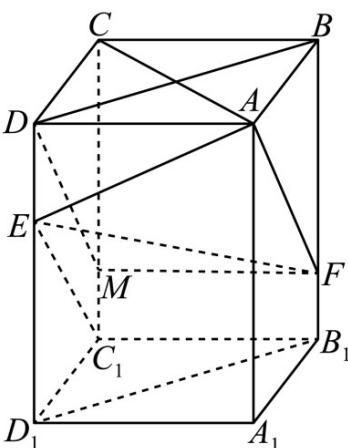

> [!faq]- 《专题21 立体几何大题综合》真题解析
>
> > [!success]- **【答案】** 详见解析
>
> > [!note]- **【分析】**
> > 【分析】（1）根据正方形性质得 $AC \perp BD$ ，根据长方体性质得 $AC \perp BB_{1}$ ，进而可证 $AC \perp$ 平面 $BB_{1}D_{1}D$ ，即得结果；
> >
> > (2) 只需证明 $EC_{1}//AF$ 即可，在 $CC_{1}$ 上取点 M 使得 $CM = 2MC_{1}$ ，再通过平行四边形性质进行证明即可.
>
> > [!note]- **【解析】**
> > 【详解】
> > 
> > (1) 因为长方体 $ABCD - A_{1}B_{1}C_{1}D_{1}$ ，所以 $BB_{1} \perp$ 平面 $ABCD \therefore AC \perp BB_{1}$
> > 因为长方体 $ABCD-A_{1}B_{1}C_{1}D_{1}, AB=BC$ ，所以四边形 ABCD 为正方形 $\therefore AC \perp BD$
> > 因为 $BB_{1}$ I BD = B, $BB_{1}$ , $BD \subset$ 平面 $BB_{1}D_{1}D$ ，因此 $AC \perp$ 平面 $BB_{1}D_{1}D$ ，
> > 因为 $EF \subset$ 平面 $BB_{1}D_{1}D$ ，所以 $AC \perp EF$ ；
> > (2) 在 $CC_{1}$ 上取点 M 使得 $CM = 2MC_{1}$ ，连 DM, MF，
> > 因为 $D_{1}E = 2ED, DD_{1} // CC_{1}, DD_{1} = CC_{1}$ ，所以 $ED = MC_{1}, ED // MC_{1}$ ,
> > 所以四边形 $DMC_{1}E$ 为平行四边形，∴ $DM \parallel EC_{1}$
> > 因为 $MF // DA, MF = DA,$ 所以 $M$ 、 $F$ 、 $A$ 、 $D$ 四点共面，所以四边形 $MFAD$ 为平行四边形，
> > ∴DM//AF,∴EC₁//AF，所以E、C₁、A、F四点共面，
> > 因此 $C_1$ 在平面 $AEF$ 内
> > 【点睛】本题考查线面垂直判定定理、线线平行判定，考查基本分析论证能力，属中档题·
