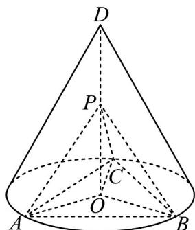

> [!faq]- 《专题21 立体几何大题综合》真题解析
>
> > [!success]- **【答案】** 详见解析
>
> > [!note]- **【分析】**
> > （1）根据已知可得 PA = PB = PC，进而有 $\triangle PAC \cong \triangle PBC$ ，可得
> >
> > $\angle APC = \angle BPC = 90^{\circ}$ ，即 $PB\perp PC$ ，从而证得 $PC\perp$ 平面 $PAB$ ，即可证得结论；
> >
> > (2) 将已知条件转化为母线 $l$ 和底面半径 $r$ 的关系，进而求出底面半径，由正弦定理，求出正三角形 $ABC$ 边长，在等腰直角三角形 $APC$ 中求出 $AP$ ，在 $Rt\triangle APO$ 中，求出 $PO$ ，即可求出结论.
>
> > [!note]- **【解析】**
> > （1）连接OA,OB,OC，∵D为圆锥顶点，O为底面圆心，∴OD⊥平面ABC，
> > $$
> > \because P \text {在} D O \text {上,} O A = O B = O C, \therefore P A = P B = P C
> > $$
> > ∵ $\triangle ABC$ 是圆内接正三角形，∴ AC = BC ， $\triangle PAC \cong \triangle PBC$
> > $\therefore \angle APC = \angle BPC = 90^{\circ}$ ，即 $PB\perp PC,PA\perp PC$
> > $PA \cap PB = P, \therefore PC \perp \text{平面} PAB, PC \subset \text{平面} PAC, \therefore \text{平面} PAB \perp \text{平面} PAC;$
> > (2) 设圆锥的母线为 $l$ ，底面半径为 $r$ ，圆锥的侧面积为 $\pi rl = \sqrt{3}\pi, rl = \sqrt{3}$ ， $OD^2 = l^2 - r^2 = 2$ ，解得 $r = 1, l = \sqrt{3}$ ， $AC = 2r\sin 60^\circ = \sqrt{3}$ ，
> > 在等腰直角三角形 $APC$ 中， $AP = \frac{\sqrt{2}}{2} AC = \frac{\sqrt{6}}{2}$ ，
> > 在 $Rt\triangle PAO$ 中， $PO = \sqrt{AP^2 - OA^2} = \sqrt{\frac{6}{4} - 1} = \frac{\sqrt{2}}{2}$ ，
> > 三棱锥 $P - ABC$ 的体积为 $V_{P - ABC} = \frac{1}{3} PO\cdot S_{\triangle ABC} = \frac{1}{3}\times \frac{\sqrt{2}}{2}\times \frac{\sqrt{3}}{4}\times 3 = \frac{\sqrt{6}}{8}$
> > 
> > 【点睛】本题考查空间线、面位置关系，证明平面与平面垂直，求锥体的体积，注意空间垂直间的相互转化，考查逻辑推理、直观想象、数学计算能力，属于中档题·
