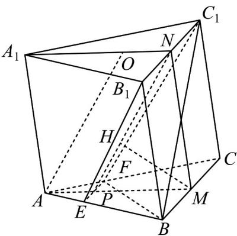
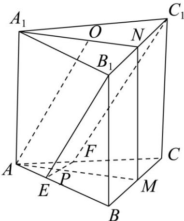

> [!faq]- 《专题21 立体几何大题综合》真题解析
>
> > [!success]- **【答案】** 详见解析
>
> > [!note]- **【分析】**
> > （1）由 $M, N$ 分别为 $BC$ ， $B_{1}C_{1}$ 的中点， $MN//CC_{1}$ ，根据条件可得 $AA_{1}//BB_{1}$ ，可证 $MN//AA_{1}$ ，要证平面 $EB_{1}C_{1}F \perp$ 平面 $A_{1}AMN$ ，只需证明 $EF \perp$ 平面 $A_{1}AMN$ 即可；
> >
> > (2) 根据已知条件求得 $S_{四边形EB_{1}C_{1}F}$ 和 M 到 PN 的距离，根据锥体体积公式，即可求得 $V_{B-EB_{1}C_{1}F}$
>
> > [!note]- **【解析】**
> > （1）∵ M, N 分别为 BC， $B_{1}C_{1}$ 的中点，
> > $$
> > \therefore M N \parallel B B _ {1}
> > $$
> > 又 $AA_{1} //BB_{1}$
> > $\therefore MN//AA_{1}$
> > 在等边 $\triangle ABC$ 中， $M$ 为 $BC$ 中点，则 $BC \perp AM$
> > 又∵侧面 $BB_{1}C_{1}C$ 为矩形，
> > $\therefore BC \perp BB_{1}$
> > $\because MN//BB_{1}$
> > $$
> > M N \perp B C
> > $$
> > 由 $MN \cap AM = M$ ， $MN, AM \subset$ 平面 $A_{1}AMN$
> > $\therefore BC \perp$ 平面 $A_{1}AMN$
> > 又∵ $B_{1}C_{1}//BC$ ，且 $B_{1}C_{1}\not\subset$ 平面 ABC， $BC\subset$ 平面 ABC，
> > $\therefore B_{1}C_{1}//$ 平面 ABC
> > 又∵ $B_{1}C_{1}\subset$ 平面 $EB_{1}C_{1}F$ ，且平面 $EB_{1}C_{1}F\cap$ 平面 $ABC = EF$
> > $\therefore B_{1}C_{1} // EF$
> > $$
> > \therefore E F \parallel B C
> > $$
> > 又∵ BC ⊥ 平面 $A_{1}AMN$
> > $\therefore EF \perp$ 平面 $A_{1}AMN$
> > $\because EF \subset$ 平面 $EB_{1}C_{1}F$
> > ∴平面 $EB_{1}C_{1}F$ ⊥平面 $A_{1}AMN$
> > (2) 过 M 作 PN 垂线，交点为 H，
> > 画出图形，如图
> > 
> > ∵ $AO \parallel$ 平面 $EB_{1}C_{1}F$
> > $AO \subset$ 平面 $A_{1}AMN$ ，平面 $A_{1}AMN \cap$ 平面 $EB_{1}C_{1}F = NP$
> > $\therefore AO//NP$
> > 又∵ NO//AP
> > $\therefore AO = NP = 6$
> > ∵ $O_{为} \triangle A_{1}B_{1}C_{1}$ 的中心·
> > $\therefore ON = \frac{1}{3} A_{1}C_{1}\sin 60^{\circ} = \frac{1}{3} \times 6 \times \sin 60^{\circ} = \sqrt{3}$
> > 故： $ON = AP = \sqrt{3}$ ，则 $AM = 3AP = 3\sqrt{3}$
> > $\because$ 平面 $EB_{1}C_{1}F \perp$ 平面 $A_{1}AMN$ ，平面 $EB_{1}C_{1}F \cap$ 平面 $A_{1}AMN = NP$
> > $MH \subset$ 平面 $A_{1}AMN$
> > ∴ $MH \perp$ 平面 $EB_{1}C_{1}F$
> > 又∵ 在等边 $\triangle ABC$ 中 $\frac{EF}{BC} = \frac{AP}{AM}$
> > 即 $EF = \frac{AP\cdot BC}{AM} = \frac{\sqrt{3}\times 6}{3\sqrt{3}} = 2$
> > 由（1）知，四边形 $EB_{1}C_{1}F$ 为梯形
> > 四边形 $EB_{1}C_{1}F$ 的面积为： $S_{\text{四边形}EB_{1}C_{1}F} = \frac{EF + B_{1}C_{1}}{2}\cdot NP = \frac{2 + 6}{2}\times 6 = 24$
> > $\therefore V_{B - EB_1C_1F} = \frac{1}{3} S_{\text{四边形}EB_1C_1F}\cdot h$
> > $h$ 为 $M$ 到 $PN$ 的距离 $MH = 2\sqrt{3}\cdot \sin 60^{\circ} = 3$
> > $$
> > \therefore V = \frac {1}{3} \times 2 4 \times 3 = 2 4.
> > $$
> > 【点睛】本题主要考查了证明线线平行和面面垂直，及其求四棱锥的体积，解题关键是掌握面面垂直转为求证线面垂直的证法和棱锥的体积公式，考查了分析能力和空间想象能力，属于中档题·
> > 
