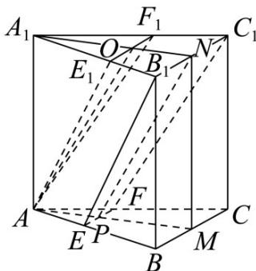
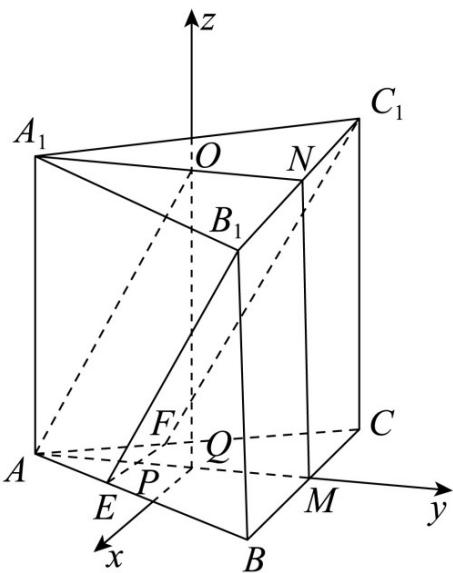

> [!faq]- 《专题21 立体几何大题综合》真题解析
>
> > [!success]- **【答案】** 详见解析
>
> > [!note]- **【分析】**
> > （1）由 $M, N$ 分别为 $BC$ ， $B_{1}C_{1}$ 的中点， $MN//CC_{1}$ ，根据条件可得 $AA_{1}//BB_{1}$ ，可证 $MN//AA_{1}$ ，要证平面 $EB_{1}C_{1}F \perp$ 平面 $A_{1}AMN$ ，只需证明 $EF \perp$ 平面 $A_{1}AMN$ 即可；
> >
> > (2) 连接 NP，先求证四边形 ONPA 是平行四边形，根据几何关系求得 EP，在 $B_{1}C_{1}$ 截取 $B_{1}Q = EP$ ，由
> >
> > (1) $BC \perp$ 平面 $A_{1}AMN$ ，可得 $\angle QPN$ 为 $B_{1}E$ 与平面 $A_{1}AMN$ 所成角，即可求得答案.
>
> > [!note]- **【解析】**
> > （1）∵ M, N 分别为 BC， $B_{1}C_{1}$ 的中点，
> > $$
> > \therefore M N \mathbin {/ /} B B _ {1}
> > $$
> > 又 $AA_{1} //BB_{1}$
> > $\therefore MN//AA_{1}$
> > 在 $\triangle ABC$ 中，M 为 BC 中点，则 $BC \perp AM$ ，
> > 又∵侧面 $BB_{1}C_{1}C$ 为矩形，
> > $\therefore BC \perp BB_{1}$
> > $\because MN//BB_{1}$
> > MN ⊥ BC
> > 由 $MN \cap AM = M$ ，MN, $AM \subset$ 平面 $A_{1}AMN$
> > $\therefore BC \perp$ 平面 $A_{1}AMN$
> > 又∵ $B_{1}C_{1}//BC$ ，且 $B_{1}C_{1}\notin$ 平面ABC， $BC\subset$ 平面ABC，
> > $\therefore B_{1}C_{1} //$ 平面 $ABC$
> > 又∵ $B_{1}C_{1}\subset$ 平面 $EB_{1}C_{1}F$ ，且平面 $EB_{1}C_{1}F\cap$ 平面 $ABC = EF$
> > $\therefore B_{1}C_{1} / / EF$
> > $\therefore EF//BC$
> > 又∵ $BC \perp$ 平面 $A_{1}AMN$
> > $\therefore EF \perp$ 平面 $A_{1}AMN$
> > ∵ $EF \subset$ 平面 $EB_{1}C_{1}F$
> > ∴平面 $EB_{1}C_{1}F \perp$ 平面 $A_{1}AMN$ .
> > (2)[方法一]：几何法
> > 如图，过 $O$ 作 $B_{1}C_{1}$ 的平行线分别交 $A_{1}B_{1}, A_{1}C_{1}$ 于点 $E_{1}, F_{1}$ ，联结 $AE_{1}, AO, AF_{1}, NP$
> > 由于 $AO / /$ 平面 $EB_{1}C_{1}F$ ， $E_{1}F_{1} / /$ 平面 $EB_{1}C_{1}F$ ， $AO\cap E_1F_1 = O$
> > $AO \subset$ 平面 $AE_{1}F_{1}$ ， $E_{1}F_{1} \subset$ 平面 $AE_{1}F_{1}$ ，所以平面 $AE_{1}F_{1} //$ 平面 $EB_{1}C_{1}F$
> > 又因平面 $AE_{1}F_{1}\cap$ 平面 $AA_{1}B_{1}B = AE_{1}$ ，平面 $EB_{1}C_{1}F\cap$ 平面 $AA_{1}B_{1}B = EB_{1}$ ，所以 $EB_{1}\parallel AE_{1}$
> > 
> > 因为 $B_{1}C_{1}\perp A_{1}N$ ， $B_{1}C_{1}\perp MN$ ， $A_{1}N\cap MN = N$ ，所以 $B_{1}C_{1}\perp$ 面 $AA_{1}NM$
> > 又因 $E_{1}F_{1}\parallel B_{1}C_{1}$ ，所以 $E_{1}F_{1}\perp$ 面 $AA_{1}NM$ ，
> > 所以 $AE_{1}$ 与平面 $AA_{1}NM$ 所成的角为 $\angle E_{1}AO$
> > 令 $AB = 2$ ，则 $NB_{1} = 1$ ，由于 $O$ 为 $\triangle A_1B_1C_1$ 的中心，故 $OE_{1} = \frac{2}{3} NB_{1} = \frac{2}{3}$
> > 在 $Rt\triangle AE_{1}O$ 中， $AO = AB = 2, OE_{1} = \frac{2}{3}$
> > 由勾股定理得 $AE_{1}=\sqrt{AO^{2}+OE_{1}^{2}}=\frac{2\sqrt{10}}{3}$
> > 所以 $\sin\angle E_{1}AO=\frac{E_{1}O}{AE_{1}}=\frac{\sqrt{10}}{10}$
> > 由于 $EB_{1}\parallel AE_{1}$ ，直线 $B_{1}E$ 与平面 $A_{1}AMN$ 所成角的正弦值也为 $\frac{\sqrt{10}}{10}$
> > ## [方法二]【最优解】：几何法
> > 因为 $AO //$ 平面 $EFC_{1}B_{1}$ ，平面 $EFC_{1}B_{1} \cap$ 平面 $AMNA_{1} = NP$ ，所以 $AO \parallel NP$ 。
> > 因为 $ON \parallel AP$ ，所以四边形 $OAPN$ 为平行四边形。
> > 由（Ⅰ）知 $EF \perp$ 平面 $AMNA_{1}$ ，则 $EF$ 为平面 $AMNA_{1}$ 的垂线。
> > 所以 $B_{1}E$ 在平面 $AMNA_{1}$ 的射影为 NP .
> > 从而 $B_{1}E$ 与 NP 所成角的正弦值即为所求.
> > 在梯形 $EFC_{1}B_{1}$ 中，设 $EF = 1$ ，过 $E$ 作 $EG\perp B_1C_1$ ，垂足为 $G$ ，则 $PN = EG = 3$
> > 在直角三角形 $B_{1}EG$ 中， $\sin \angle B_{1}EG = \frac{1}{\sqrt{10}} = \frac{\sqrt{10}}{10}$ 。
> > [方法三]：向量法
> > 由（1）知， $B_{1}C_{1}\perp$ 平面 $A_{1}AMN$ ，则 $B_{1}C_{1}$ 为平面 $A_{1}AMN$ 的法向量.
> > 因为 $AO \parallel$ 平面 $EB_{1}C_{1}F$ ， $AO \subseteq$ 平面 $A_{1}AMN$ ，且平面 $A_{1}AMN \cap$ 平面 $EB_{1}C_{1}F = PN$
> > 所以 $AO \parallel PN$
> > 由（Ⅰ）知 $AA_{1}\parallel MN,AA_{1}=MN$ ，即四边形APNO为平行四边形，则AO=NP=AB
> > 因为 $O$ 为正 $\triangle A_{1}B_{1}C_{1}$ 的中心，故 $AP = ON = \frac{1}{3} AM$
> > 由面面平行的性质得 $EF \parallel \frac{1}{3} B_1 C_1, EF = \frac{1}{3} B_1 C_1$ ，所以四边形 $EFC_1 B_1$ 为等腰梯形。
> > 由 $P$ ， $N$ 为等腰梯形两底的中点，得 $PN\perp B_1C_1$ ，则 $\overline{PN}\cdot \overline{B}_1C_1 = 0,\overline{EB}_1 = \overline{EP} +\overline{PN} +\overline{NB}_1 =$
> > $$
> > \frac {1}{6} B _ {1} C _ {1} + P N - \frac {1}{2} B _ {1} C _ {1} = P N - \frac {1}{3} B _ {1} C _ {1}
> > $$
> > 设直线 与平面 所成角为 ，，则 $\sin \theta = \left|\frac{\boxed{\square\boxed{\square}}\cdot\boxed{\square\boxed{\square}\boxed{\square}}}{\boxed{\square\boxed{\square}}\cdot\boxed{\square\boxed{\square}\boxed{\square}}}\right| = \frac{1}{3}a^2$ $a\sqrt{a^2 + \left(\frac{1}{3}a\right)^2} = \frac{\sqrt{10}}{10}$
> > 所以直线 $B_{1}E$ 与平面 $A_{1}AMN$ 所成角的正弦值 $\frac{\sqrt{10}}{10}$ .
> > ## [方法四]：基底法
> > 不妨设 AO = AB = AC = 2
> > 以向量 $AA_{1}, AB, AC$ 为基底，
> > 从而 $\left\langle AA_1, AB\right\rangle = \left\langle AA_1, AC\right\rangle$ ， $\left\langle AB, AC\right\rangle = \frac{\pi}{3}$ 。
> > $EB_{1} = EA + AA_{1} + A_{1}B_{1} = \frac{2}{3} AB + AA_{1}$ ， $BC = AC - AB$
> > 则 $\left|\overrightarrow{EB_{1}}\right|=\frac{2\sqrt{10}}{3}$ ， $|BC|=2$
> > 所以 $\overline{EB_{1}}\cdot\overline{BC}=\left(\frac{2}{3}\overline{AB}+\overline{AA_{1}}\right)\cdot\left(\overline{AC}-\overline{AB}\right)=\frac{2}{3}\overline{AB}\cdot\overline{AC}-\frac{2}{3}\overline{AB}^{2}=-\frac{4}{3}$
> > 由（1）知 $BC \perp$ 平面 $A_{1}AMN$ ，所以向量 $\overline{BC}$ 为平面 $A_{1}AMN$ 的法向量。
> > 设直线 $B_{1}E$ 与平面 $A_{1}AMN$ 所成角 $\theta$ ，则 $\sin \theta = \left|\cos \left\langle \overrightarrow{EB_1}, \overrightarrow{BC}\right\rangle \right| = \left|\frac{\overrightarrow{EB_1} \cdot \overrightarrow{BC}}{\left|\overrightarrow{EB_1}\right| \left|\overrightarrow{BC}\right|}\right| = \frac{\sqrt{10}}{10}$ 。
> > 故直线 $B_{1}E$ 与平面 $A_{1}AMN$ 所成角的正弦值为 $\sin \theta = \frac{\sqrt{10}}{10}$
> > [方法五]：坐标法
> > 
> > 过 O 过底面 ABC 的垂线，垂足为 Q，以 Q 为坐标原点建立如图所示空间直角坐标系，
> > 设 $\angle OAM = \theta$ ，AO=AB=2，
> > $$
> > B _ {1} \left(1, \frac {\sqrt {3}}{3}, 2 \sin \theta\right), A (0, - 2 \cos \theta , 0), B (1, \sqrt {3} - 2 \cos \theta , 0)
> > $$
> > 所以 $\overrightarrow{AE}=\frac{1}{3}\overrightarrow{AB}=\left(\frac{1}{3},\frac{\sqrt{3}}{3},0\right),E\left(\frac{1}{3},\frac{\sqrt{3}}{3}-2\cos\theta,0\right)$
> > 所以 $B_{1}E=\left(-\frac{2}{3},-2\cos\theta,-2\sin\theta\right)$ ,
> > 易得 $n^{1}=(1,0,0)$ 为平面 $A_{l}AMN$ 的一个法向量，
> > 则直线 $B_{1}E$ 与平面 $A_{1}AMN$ 所成角的正弦值为 $\left|\cos \left\langle n,B_1E\right\rangle \right| = \frac{\left|\vec{n}\cdot B_1E\right|}{\left|n\right|\cdot\left|\vec{B}_1E\right|} = \frac{\frac{2}{3}}{\sqrt{\frac{4}{9} + 4}} = \frac{\sqrt{10}}{10}$
> > 【整体点评】 $^{(2)}$ 方法一：几何法的核心在于找到线面角，本题中利用平行关系进行等价转化是解决问题的关键；
> > 方法二：等价转化是解决问题的关键，构造直角三角形是求解角度的正弦值的基本方法；
> > 方法三：利用向量法的核心是找到平面的法向量和直线的方向向量，然后利用向量法求解即可；
> > 方法四：基底法是立体几何的重要思想，它是平面向量基本定理的延伸，其关键之处在于找到平面的法向量和直线的方向向量·
> > 方法五：空间坐标系法是立体几何的重要方法，它是平面向量的延伸，其关键之处在于利用空间坐标系确
> > 定位置，找到平面的法向量和直线的方向向量·
