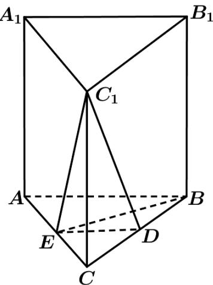

> [!faq]- 《专题21 立体几何大题综合》真题解析
>
> > [!success]- **【答案】** 详见解析
>
> > [!note]- **【分析】**
> > $^{(1)}$ 由题意结合几何体的空间结构特征和线面平行的判定定理即可证得题中的结论；
> >
> > (2)由题意首先证得线面垂直，然后结合线面垂直证明线线垂直即可·
>
> > [!note]- **【解析】**
> > （1）因为 D, E 分别为 BC, AC 的中点，
> > 
> > 所以 $ED^{\parallel}AB$ .
> > 在直三棱柱 $ABC-A_{1}B_{1}C_{1}$ 中， $AB^{\parallel}A_{1}B_{1}$
> > 所以 $A_{1}B_{1} \parallel ED$ .
> > 又因为 $ED \subset$ 平面 $DEC_{1}$ ， $A_{1}B_{1} \not\subset$ 平面 $DEC_{1}$ ，
> > 所以 $A_{1}B_{1}$ 平面 $DEC_{1}$
> > (2) 因为 AB=BC, E 为 AC 的中点，所以 $BE \perp AC$ .
> > 因为三棱柱 $ABC-A_{1}B_{1}C_{1}$ 是直棱柱，所以 $CC_{1}\perp$ 平面 ABC.
> > 又因为 $BE \subset$ 平面 ABC，所以 $CC_{1} \perp BE$ .
> > 因为 $C_{1}C \subset$ 平面 $A_{1}ACC_{1}$ ， $AC \subset$ 平面 $A_{1}ACC_{1}$ ， $C_{1}C \cap AC = C$ ，
> > 所以 $BE^{\perp}$ 平面 $A_{1}ACC_{1}$
> > 因为 $C_{1}E \subset$ 平面 $A_{1}ACC_{1}$ ，所以 $BE \perp C_{1}E$ .
> > 【点睛】本题主要考查直线与直线、直线与平面、平面与平面的位置关系等基础知识，考查空间想象能力和推理论证能力·
