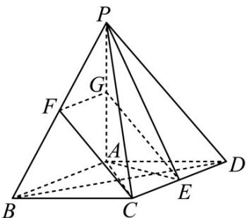

> [!faq]- 《专题21 立体几何大题综合》真题解析
>
> > [!success]- **【答案】** 详见解析
>
> > [!note]- **【分析】**
> > 【分析】(1)由题意利用线面垂直的判定定理即可证得题中的结论；
> >
> > (Ⅱ)由几何体的空间结构特征首先证得线面垂直，然后利用面面垂直的判断定理可得面面垂直；
> >
> > (III)由题意，利用平行四边形的性质和线面平行的判定定理即可找到满足题意的点·
>
> > [!note]- **【解析】**
> > 【详解】（Ⅰ）证明：因为 $PA \perp$ 平面 ABCD，所以 $PA \perp BD$ ；
> > 因为底面 ABCD 是菱形，所以 $AC \perp BD$ ;
> > 因为 $PA \cap AC = A, PA, AC \subset$ 平面 PAC，
> > 所以 $BD \perp$ 平面 PAC .
> > (Ⅱ) 证明：因为底面 ABCD 是菱形且 $\angle ABC = 60^{\circ}$ ，所以 $\Delta ACD$ 为正三角形，所以 $AE \perp CD$ ，
> > 因为 $AB \parallel CD$ ，所以 $AE \perp AB$ ；
> > 因为 $PA \perp$ 平面 ABCD ， $AE \subset$ 平面 ABCD，
> > 所以 $AE \perp PA$ ；
> > 因为 $PA \cap AB = A$
> > 所以 $AE \perp$ 平面 PAB ，
> > $AE \subset$ 平面 PAE，所以平面 $PAB \perp$ 平面 PAE。
> > （Ⅲ）存在点 F 为 PB 中点时，满足 $CF \parallel$ 平面 PAE；理由如下：
> > 
> > 分别取 PB, PA 的中点 F, G ，连接 CF, FG, EG，
> > 在三角形 $PAB$ 中， $FG // AB$ 且 $FG = \frac{1}{2} AB$
> > 在菱形 ABCD 中，E 为 CD 中点，所以 CE // AB 且 $CE = \frac{1}{2} AB$ ，所以 CE // FG 且 CE = FG，即四边形 CEGF 为平行四边形，所以 CF // EG；
> > 又 $CF \notin$ 平面 $PAE$ ， $EG \subset$ 平面 $PAE$ ，所以 $CF //$ 平面 $PAE$ .
> > 【点睛】本题主要考查线面垂直的判定定理，面面垂直的判定定理，立体几何中的探索问题等知识，意在考查学生的转化能力和计算求解能力·
