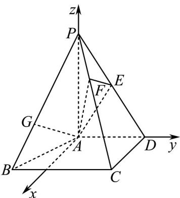

> [!faq]- 《专题21 立体几何大题综合》真题解析
>
> > [!success]- **【答案】** 详见解析
>
> > [!note]- **【分析】**
> > 【分析】(Ⅰ)由题意利用线面垂直的判定定理即可证得题中的结论；
> >
> > (Ⅱ)建立空间直角坐标系，结合两个半平面的法向量即可求得二面角 $F-AE-P$ 的余弦值；
> >
> > (III)首先求得点 G 的坐标，然后结合平面 AEF 的法向量和直线 AG 的方向向量可判断直线是否在平面内.
>
> > [!note]- **【解析】**
> > 【详解】(Ⅰ)由于 $PA \perp$ 平面 ABCD， $CD \subset$ 平面 ABCD，则 $PA \perp CD$ ，
> > 由题意可知 $AD \perp CD$ ，且 $PA \cap AD = A$ ，
> > 由线面垂直的判定定理可得 $CD^{\perp}$ 平面 $PAD$ .
> > (Ⅱ)以点 A 为坐标原点，平面 ABCD 内与 AD 垂直的直线为 x 轴，AD, AP 方向为 y 轴，z 轴建立如图所示的空间直角坐标系 A - xyz ，
> > 
> > 易知： $A(0,0,0),P(0,0,2),C(2,2,0),D(0,2,0)$
> > 由 $PF = \frac{1}{3} PC$ 可得点 $F$ 的坐标为 $F\left(\frac{2}{3},\frac{2}{3},\frac{4}{3}\right)$
> > 由 $\overline{PE}=\frac{1}{2}\overline{PD}$ 可得 $E(0,1,1)$
> > 设平面 $AEF$ 的法向量为： $\stackrel{\sqcup}{m} = (x,y,z)$ ，则
> > $$
> > \left\{\begin{array}{c}\stackrel {\rightharpoonup} {m} \cdot A F = (x, y, z) \cdot \left(\frac {2}{3}, \frac {2}{3}, \frac {4}{3}\right) = \frac {2}{3} x + \frac {2}{3} y + \frac {4}{3} z = 0\\\stackrel {\rightharpoonup} {m} \cdot A E = (x, y, z) \cdot (0, 1, 1) = y + z = 0\end{array}\right.
> > $$
> > 据此可得平面 AEF 的一个法向量为： $m = (1, 1, -1)$
> > 很明显平面 AEP 的一个法向量为 $n = (1, 0, 0)$ ,
> > $\cos < m, n > = \frac{\vec{m} \cdot n}{|m| \times |n|} = \frac{1}{\sqrt{3} \times 1} = \frac{\sqrt{3}}{3}$
> > 二面角 $F - AE - P$ 的平面角为锐角，故二面角 $F - AE - P$ 的余弦值为 $\frac{\sqrt{3}}{3}$
> > (III) 易知 $P(0,0,2), B(2,-1,0)$ ，由 $\overline{PG} = \frac{2}{3} \overline{PB}$ 可得 $G\left(\frac{4}{3}, -\frac{2}{3}, \frac{2}{3}\right)$
> > 则 $AG = \left( \frac{4}{3}, -\frac{2}{3}, \frac{2}{3} \right)$
> > 注意到平面 AEF 的一个法向量为： $m = (1, 1, -1)$
> > 其 $m \cdot AG = 0$ 且点 $A$ 在平面 $AEF$ 内，故直线 $AG$ 在平面 $AEF$ 内
