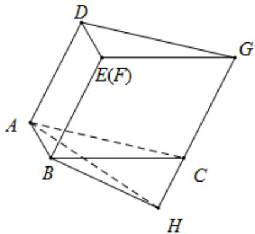

> [!faq]- 《专题21 立体几何大题综合》真题解析
>
> > [!success]- **【答案】** 详见解析
>
> > [!note]- **【分析】**
> > 【分析】(1)因为折纸和粘合不改变矩形 $ABED$ ， $\mathrm{Rt}\triangle ABC$ 和菱形 $BFGC$ 内部的夹角，所以 $AD//BE$ ， $BF//CG$ 依然成立，又因 $E$ 和 $F$ 粘在一起，所以得证·因为 $AB$ 是平面 $BCGE$ 垂线，所以易证.(2)在图中找到 $B-CG-A$ 对应的平面角，再求此平面角即可·于是考虑 $B$ 关于 $GC$ 的垂线，发现此垂足与 $\mathbf{A}$ 的连线也垂直于 $CG$ ·按照此思路即证·
>
> > [!note]- **【解析】**
> > 【详解】 $^{(1)}$ 证：∵ AD // BE，BF // CG，又因为 E 和 F 粘在一起.
> > ∴ AD // CG, A, C, G, D 四点共面.
> > 又∵ $AB \perp BE, AB \perp BC$ .
> > ∴ $AB \perp$ 平面 BCGE，∵ $AB \subset$ 平面 ABC，∴ 平面 $ABC \perp$ 平面 BCGE，得证.
> > (2) 过 B 作 $BH \perp GC$ 延长线于 H，连结 AH，因为 $AB \perp$ 平面 BCGE，所以 $AB \perp GC$
> > 而又 $BH \perp GC$ ，故 $GC \perp$ 平面 $HAB$ ，所以 $AH \perp GC \cdot$ 又因为 $BH \perp GC$ 所以 $\angle BHA$ 是二面角 $B - CG - A$ 的平面角，而在 $\triangle BHC$ 中 $\angle BHC = 90^\circ$ ，又因为 $\angle FBC = 60^\circ$ 故 $\angle BCH = 60^\circ$ ，所以 $BH = BC\sin 60^\circ = \sqrt{3}$ 。
> > 而在 $\triangle ABH$ 中 $\angle ABH = 90^{\circ}$ , $\tan \angle BHA = \frac{AB}{BH} = \frac{1}{\sqrt{3}} = \frac{\sqrt{3}}{3}$ , 即二面角 $B - CG - A$ 的度数为 $30^{\circ}$ .
> > 
> > 【点睛】很新颖的立体几何考题．首先是多面体粘合问题，考查考生在粘合过程中哪些量是不变的．再者粘合后的多面体不是直棱柱，建系的向量解法在本题中略显麻烦，突出考查几何方法．最后将求二面角转化为求二面角的平面角问题考查考生的空间想象能力．
