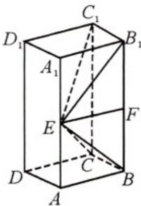

> [!faq]- 《专题21 立体几何大题综合》真题解析
>
> > [!success]- **【答案】** 详见解析
>
> > [!note]- **【分析】**
> > （1）先由长方体得， $B_{1}C_{1}\perp$ 平面 $AA_{1}B_{1}B$ ，得到 $B_{1}C_{1}\perp BE$ ，再由 $BE\perp EC_{1}$ ，根据线面垂直的判定定理，即可证明结论成立；
> >
> > (2) 先设长方体侧棱长为 $2a$ ，根据题中条件求出 $a = 3$ ；再取 $BB_{1}$ 中点 $F$ ，连结 $EF$ ，证明 $EF \perp$ 平面 $BB_{1}C_{1}C$ ，根据四棱锥的体积公式，即可求出结果。
>
> > [!note]- **【解析】**
> > （1）因为在长方体 $ABCD-A_{1}B_{1}C_{1}D_{1}$ 中， $B_{1}C_{1}\perp$ 平面 $AA_{1}B_{1}B$ ；
> > $BE \subset$ 平面 $AA_{1}B_{1}B$ ，所以 $B_{1}C_{1} \perp BE$
> > 又 $BE \perp EC_{1}$ ， $B_{1}C_{1} \cap EC_{1} = C_{1}$ ，且 $EC_{1} \subset$ 平面 $EB_{1}C_{1}$ ， $B_{1}C_{1} \subset$ 平面 $EB_{1}C_{1}$
> > 所以 $BE \perp$ 平面 $EB_{1}C_{1}$ ;
> > ## (2) [方法一]【利用体积公式计算体积】
> > 如图6，设长方体的侧棱长为 $2a$ ，则 $AE = A_{1}E = a$
> > 由（1）可得 $EB_{1} \perp BE$ 。所以 $EB_{1}^{2} + BE^{2} = BB_{1}^{2}$ ，即 $2BE^{2} = BB_{1}^{2}$
> > 又 $AB = 3$ ，所以 $2AE^{2} + 2AB^{2} = BB_{1}^{2}$ ，即 $2a^{2} + 18 = 4a^{2}$ ，解得 $a = 3$ ：
> > 取 $BB_{1}$ 中点 $F$ ，联结 $EF$ ，因为 $AE = A_{1}E$ ，则 $EF \parallel AB$ ，所以 $EF \perp$ 平面 $BB_{1}C_{1}C$
> > 从而四棱锥 $E - BB_{1}C_{1}C$ 的体积：
> > $$
> > V _ {E - B B _ {1} C _ {1} C} = \frac {1}{3} S _ {\text {矩形} B B C _ {1} C} \cdot E F = \frac {1}{3} \cdot B C \cdot B B _ {1} \cdot E F = \frac {1}{3} \times 3 \times 6 \times 3 = 1 8
> > $$
> > 
> > 图6
> > [方法二]【最优解：利用不同几何体之间体积的比例关系计算体积】
> > 取 $BB_{1}$ 的中点 $F$ ，联结 $EF$ ．由（I）可知 $BE \perp EB_{1}$
> > 所以 $EF = \frac{1}{2} BB_{1} = AB = 3, BB_{1} = 6$ 故 $V_{E - BB_1C_1C} = \frac{1}{3} V_{\text{长方体}} = \frac{1}{3} \times 3 \times 3 \times 6 = 18$
> > 【整体点评】(2)方法一：利用体积公式计算体积需要同时计算底面积和高，是计算体积的传统方法；方法二：利用不同几何体之间的比例关系计算体积是一种方便有效快速的计算体积的方法，核心思想为等价转化·
