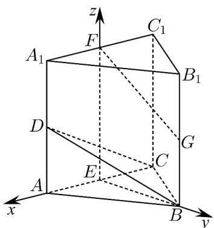
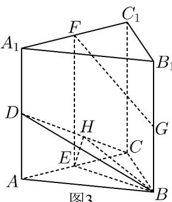
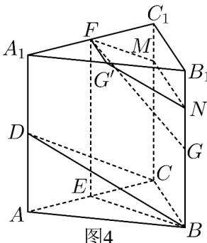
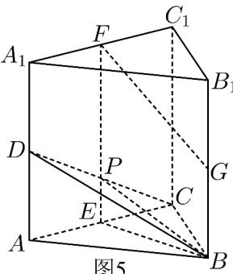

> [!faq]- 《专题21 立体几何大题综合》真题解析
>
> > [!success]- **【答案】** 详见解析
>
> > [!note]- **【分析】**
> > 【分析】（1）由等腰三角形性质得 $AC \perp BE$ ，由线面垂直性质得 $AC \perp CC_1$ ，由三棱柱性质可得 $EF // CC_1$ ，因此 $EF \perp AC$ ，最后根据线面垂直判定定理得结论；
> >
> > (2) 根据条件建立空间直角坐标系，设各点坐标，利用方程组解得平面 $^{BCD}$ 一个法向量，根据向量数量积求得两法向量夹角，再根据二面角与法向量夹角相等或互补关系求结果；
> >
> > (3) 根据平面 BCD 一个法向量与直线 $F^{G}$ 方向向量数量积不为零，可得结论
>
> > [!note]- **【解析】**
> > 【详解】（1）在三棱柱 $ABC-A_{l}B_{l}C_{l}$ 中，
> > $\because CC_{l}\perp$ 平面 ABC，∴四边形 $A_{1}ACC_{l}$ 为矩形。
> > 又 E, F 分别为 AC, $A_{1}C_{1}$ 的中点, $\therefore AC \perp EF$ .
> > ∵AB=BC，E为AC的中点，∴AC⊥BE，而 $BE\cap EF=B$
> > $\therefore AC\perp$ 平面 BEF.
> > (2) [方法一]：【通性通法】向量法
> > 由（1）知 $AC \perp EF$ ， $AC \perp BE$ ， $EF^{\parallel}CC_{I}$ 。又 $CC_{I} \perp$ 平面 $ABC$ ，∴ $EF \perp$ 平面 $ABC$ 。
> > ∵BE⊂平面ABC，∴EF⊥BE.
> > 如图建立空间直角坐标系 $E^{-xyz}$ 。
> > 
> > 由题意得 $B(0,2,0)$ ， $C(-1,0,0)$ ， $D(1,0,1)$ ， $F(0,0,2)$ ， $G(0,2,1)$
> > $CD=(201)CB=(120)$
> > 设平面 BCD 的法向量为 $n = (a, b, c)$ ,
> > $$
> > \therefore \left\{\begin{array}{l}n \cdot C D = 0\\\rightarrow \square \square\\n \cdot C B = 0\end{array}, \therefore \left\{\begin{array}{l}2 a + c = 0\\a + 2 b = 0\end{array}, \right. \right.
> > $$
> > 令 $a = 2$ ，则 $b = -1$ ， $c = -4$
> > ∴平面 BCD 的一个法向量 $n = (2, -1, -4)$ ,
> > 又∵平面 $CDC_{1}$ 的一个法向量为 $\overrightarrow{EB}=(0,2,0)$ ，∴ $\cos\left\langle n\cdot\overrightarrow{EB}\right\rangle=\frac{n\cdot\overrightarrow{EB}}{\left|n\right|\left|EB\right|}=-\frac{\sqrt{21}}{21}$
> > 由图可得二面角 $B^{-}CD^{-}C_{l}$ 为钝角，所以二面角 $B^{-}CD^{-}C_{l}$ 的余弦值为 $-\frac{\sqrt{21}}{21}$
> > ## [方法二]：【最优解】转化+面积射影法
> > 考虑到二面角 B - CD - A 与二面角 $B - CD - C_{1}$ 互补，设二面角 $B - CD - C_{1}$ 为 $\theta$ ，易知 $DC = \sqrt{5}$ ， $DB = \sqrt{6}$ ，
> > 所以 $S_{\triangle DCE}=\frac{1}{2},S_{\triangle DCB}=\frac{\sqrt{21}}{2}$
> > 故 $\cos\theta=-\frac{S_{\triangle DCE}}{S_{\triangle DCB}}=-\frac{\frac{1}{2}}{\frac{\sqrt{21}}{2}}=-\frac{\sqrt{21}}{21}$
> > ## [方法三]：转化+三垂线法
> > 二面角 $B - CD - A$ 与二面角 $B - CD - C_{1}$ 互补，并设二面角 $B - CD - A$ 为 $\theta$ ，易知 $BE \perp$ 平面 $ACD$
> > 如图 $^{3}$ ，作 $EH \perp CD$ ，垂足为 H，联结 BH．则 $\angle BHE$ 是二面角 B - CD - A 的平面角，所以 $\angle BHE = \theta$ ，不难求出 $\cos\theta = \frac{\sqrt{21}}{21}$ ，所以二面角 $B - CD - C_{1}$ 的余弦值为 $-\frac{\sqrt{21}}{21}$ 。
> > 
> > 图3
> > (3) [方法一]：【最优解】 【通性通法】向量法
> > 平面 $BCD$ 的一个法向量为 $n = (2, -1, -4)$ ， $\because G(0, 2, 1)$ ， $F(0, 0, 2)$ ，
> > ∴ $GF=\left(0,-2,1\right)$ ，∴ $n\cdot GF=-2$ ，∴ n 与 $GF$ 不垂直，
> > $\therefore GF$ 与平面 $BCD$ 不平行且不在平面 $BCD$ 内， $\therefore GF$ 与平面 $BCD$ 相交.
> > [方法二]：几何转化
> > 如图 $^{4}$ ，取 $A_{1}B_{1}$ 的中点 $G'$ ，分别在 $BB_{1}, CC_{1}$ 取点 N, M，使 $4B_{1}N = BB_{1}, 4C_{1}M = CC_{1}$ ．联结 $FG', G'N, NM, FM$ ．则平面 DCB∥ 平面 FGNM，又 $FM \subset$ 平面 $FG'NM$ ， $FG \not\subset$ 平面 $FG'NM$ ，故直线 FG 与平面 BCD 相交．
> > 
> > [方法三]：根据相交的平面定义
> > 如图 $^{5}$ ，设 CD 与 EF 交于 P，联结 PB。
> > 
> > 因为 $EF \parallel BB_{1}$ ，且 $EF = BB_{1}$ ，所以 B, E, F, $B_{1}$ 四点共面。
> > 因为 $PF = \frac{3}{4} EF, BG = \frac{1}{2} BB_{1}$ ，所以 $PF \neq BG$ 。
> > 又 $PF \parallel BG$ ，所以四边形 $PFGB$ 是梯形，即直线 $FG$ 与直线 $BP$ 一定相交.
> > 因为 $BP \subset$ 平面 BCD ，所以直线 FG 与平面 BCD 相交．
> > 【整体点评】（2）方法一：直接利用向量法求出，属于通性通法；
> > 方法二：根据二面角 B-CD-A 与二面角 $B-CD-C_{1}$ 互补，通过转化求二面角 B-CD-A，利用面积射影法
> > 求出，是该问的最优解；
> > 方法三：根据二面角 B-CD-A 与二面角 $B-CD-C_{1}$ 互补，通过转化求二面角 B-CD-A，利用三垂线法求出；
> > （3）方法一：利用向量证明平面的法向量与直线的方向向量不垂直即可，既是该问的通性通法，也是最优解；
> > 方法二：通过证明与平面 $BCD$ 平行的平面与直线 $FG$ 相交证出；
> > 方法三：构建过直线 $FG$ 且与平面 $BCD$ 相交的平面，通过证明直线 $FG$ 与交线相交证出.
