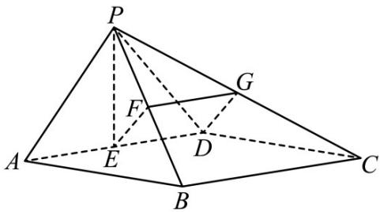

> [!faq]- 《专题21 立体几何大题综合》真题解析
>
> > [!success]- **【答案】** （Ⅰ）见解析；（Ⅱ）见解析；（Ⅲ）见解析·
>
> > [!note]- **【分析】**
> > （1）欲证 $PE \perp BC$ ，只需证明 $PE \perp AD$ 即可；
> >
> > (2) 先证 $PD \perp$ 平面 PAB ，再证平面 $PAB \perp$ 平面 PCD ；
> >
> > (3) 取 PC 中点 G，连接 FG, DG，证明 $EF \parallel DG$ ，则 $EF \parallel$ 平面 PCD.
>
> > [!note]- **【解析】**
> > （1）∵ PA = PD，且 E 为 AD 的中点，∴ PE ⊥ AD ·
> > ∵底面 ABCD 为矩形，∴ BC∥AD ，∴ PE⊥BC ；
> > (Ⅱ)∵底面ABCD为矩形，∴ $AB\perp AD\cdot$
> > ∵平面 PAD ⊥ 平面 ABCD ，平面 PAD ∩ 平面 ABCD = AD ，AB ⊂ 平面 ABCD ，
> > $\therefore AB \perp$ 平面 PAD，又 $PD \subset$ 平面 PAD， $\therefore AB \perp PD \cdot$
> > 又 $PA \perp PD$ ， $PA \cap AB = A$ ， $PA$ 、 $AB \subset$ 平面 $PAB$ ， $\therefore PD \perp$ 平面 $PAB$
> > ∵ $PD \subset$ 平面 PCD ，∴ 平面 $PAB \perp$ 平面 PCD ；
> > (Ⅲ) 如图，取 $PC$ 中点 $G$ ，连接 $FG, GD$ .
> > 
> > ∵F,G分别为 $_{PB}$ 和PC的中点，∴FG//BC，且 $FG=\frac{1}{2}BC$ .
> > ∵四边形 ABCD 为矩形，且 E 为 AD 的中点，∴ $ED \parallel BC, DE = \frac{1}{2} BC$ ，
> > ∴ED//FG，且 $ED = FG$ ，∴四边形EFGD为平行四边形，
> > ∴ EF//GD，又 EF ∉ 平面 PCD，GD ⊂ 平面 PCD，∴ EF// 平面 PCD.
> > 【点睛】证明面面关系的核心是证明线面关系，证明线面关系的核心是证明线线关系·证明线线平行的方法：
> > (1) 线面平行的性质定理；(2) 三角形中位线法；(3) 平行四边形法·证明线线垂直的常用方法：
> > (1) 等腰三角形三线合一；(2) 勾股定理逆定理；(3) 线面垂直的性质定理；(4) 菱形对角线互相垂直.
