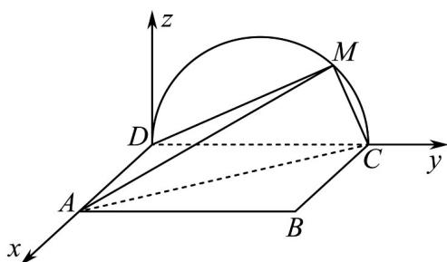
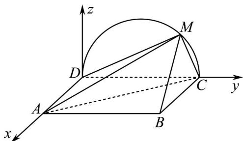
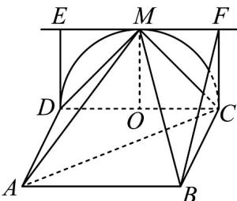
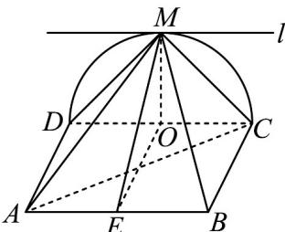

> [!faq]- 《专题21 立体几何大题综合》真题解析
>
> > [!success]- **【答案】** 详见解析
>
> > [!note]- **【分析】**
> > （1）方法一：先证 $BC \perp$ 平面 $CMD$ ，得 $BC \perp DM$ ，再证 $CM \perp DM$ ，由线面垂直的判定定理可得 $DM \perp$ 平面 $BMC$ ，即可根据面面垂直的判定定理证出；
> >
> > (2) 方法一：先建立空间直角坐标系，然后判断出 $M$ 的位置，求出平面 $MAB$ 和平面 $MCD$ 的法向量，进而求得平面 $MAB$ 与平面 $MCD$ 所成二面角的正弦值。
>
> > [!note]- **【解析】**
> > （ $^{1}$ ）[方法一]：【最优解】判定定理
> > 由题设知·平面 $CMD^{\perp}$ 平面 ABCD，交线为 CD·因为 $BC^{\perp}CD, BC \subset$ 平面 ABCD，所以 $BC^{\perp}$ 平面 CMD，故 $BC^{\perp}DM$ 。因为 M 为 CD 上异于 C，D 的点，且 DC 为直径，所以 $DM^{\perp}CM$ 。
> > 又 $BC \cap CM = C$ , 所以 $DM \perp$ 平面 $BMC$ . 而 $DM \subset$ 平面 $AMD$ , 故平面 $AMD \perp$ 平面 $BMC$ .
> > [方法二]：判定定理
> > 由题设知·平面 $CMD \perp$ 平面 ABCD，交线为 CD·因为 $AD \perp CD$ ， $AD \subset$ 平面 ABCD，所以 $AD \perp$ 平面 MCD，而 $CM \subset$ 平面 MCD，所以 $AD \perp CM$ ，因为 M 为 CD 上异于 C，D 的点，且 DC 为直径，所以 $DM \perp CM \cdot$ 又 $AD \cap DM = D$ ，所以，CM ⊥ 平面 AMD，而 CM ⊂ 平面 BMC，所以平面 AMD ⊥ 平面 BMC。
> > [方法三]：向量法
> > 建立直角坐标系，如图 $^{2}$ ，设 $M(0,a,b)$ ， $D(0,0,0)$ ， $A(2,0,0)$ ， $B(2,2,0)$ ， $C(0,2,0)$ ，
> > 所以 $\overline{DA}=(2,0,0),\overline{DM}=(0,a,b)$
> > 设平面 $_{AMD}$ 的一个法向量为 $m = (x_{1}, y_{1}, z_{1})$ ，所以 $\left\{\begin{aligned}&n \cdot DA = 0 \\&n \cdot DM = 0\end{aligned}\right.$ ，即 $\left\{\begin{aligned}&2x_{1} = 0 \\&ay_{1} + bz_{1} = 0\end{aligned}\right.$
> > 取平面AMD的一个法向量 $m = (0,b, - a)$
> > 同理可得，平面 $BMC$ 的一个法向量 $n = (0, b, 2 - a)$ ，因为点 $M$ 在以 $(0, 1, 0)$ 为圆心，半径为1的圆上，所以， $(a - 1)^2 + b^2 = 1$ ，即 $a^2 + b^2 - 2a = 0$ ，而 $m \cdot n = a^2 + b^2 - 2a = 0$ ，所以平面 $AMD \perp$ 平面 $BMC$ 。
> > 
> > 图2
> > (2) [方法一]：【通性通法】向量法
> > 以 D 为坐标原点， $\overrightarrow{DA}$ 的方向为 x 轴正方向，建立如图所示的空间直角坐标系 $D^{-xyz}$
> > 
> > 当三棱锥 M-ABC 体积最大时，M 为 CD 的中点·
> > 由题设得 $D(0,0,0), A(2,0,0), B(2,2,0), C(0,2,0), M(0,1,1)$
> > $$
> > \stackrel {\square \sqcup \sqcup \sqcup} {A M} = (- 2, 1, 1), \stackrel {\square \sqcup \sqcup} {A B} = (0, 2, 0), \stackrel {\square \sqcup \sqcup} {D A} = (2, 0, 0)
> > $$
> > 设 $n = (x, y, z)$ 是平面 $MAB$ 的法向量，则
> > $\left\{ \begin{array}{l} n \cdot AM = 0 \\ \rightarrow \square \square \\ n \cdot AB = 0 \end{array} \right.$ 即 $\left\{ \begin{array}{l} -2x + y + z = 0 \\ 2y = 0 \end{array} \right.$ ，可取 $n = (1,0,2)$ .
> > $\underset{DA}{\overset{\underset{\rightarrow}{\square\square}}{\longrightarrow}}$ 是平面 MCD 的一个法向量·因此 $\cos\langle n, DA\rangle = \frac{n \cdot DA}{|n||DA|} = \frac{\sqrt{5}}{5}$ ， $\sin\langle n, DA\rangle = \frac{2\sqrt{5}}{5}$ ，
> > 所以面 $MAB$ 与面 $MCD$ 所成二面角的正弦值是 $\frac{2\sqrt{5}}{5}$ .
> > [方法二]：几何法（作平行线找公共棱）
> > 如图 $^{3}$ ，当点 M 与圆心 O 连线 $MO \perp DC$ 时，三棱锥 M - ABC 体积最大。过点 M 作 $EF \parallel DC, ED \perp DC, FC \perp DC$ ，易证 $\angle BFC$ 为所求二面角的平面角。在 $Rt^{\triangle} BCF$ 中， $\sin \angle BFC = \frac{BC}{BF} = \frac{2\sqrt{5}}{5}$ ，即面 MAB 与面 MCD 所成二面角的正弦值是 $\frac{2\sqrt{5}}{5}$ 。
> > 
> > 图3
> > [方法三]：【最优解】面积射影法
> > 设平面 MAB 与平面 MCD 所成二面角的平面角为 $\theta$
> > 由题可得 $\triangle MAB$ 在 $\triangle MCD$ 平面上的射影图形正好是 $\triangle MCD$
> > 取 $AB$ 和 $CD$ 的中点分别为 $N$ 和 $O$ ，则可得 $OM = 1$ ， $MN = \sqrt{5}$ ，所以由射影面积公式有 $\cos \theta = \frac{S_{\triangle MCD}}{S_{\triangle MAB}} = \frac{1}{\sqrt{5}}$ ，所以 $\sin \theta = \frac{2\sqrt{5}}{5}$ ，即面 $MAB$ 与面 $MCD$ 所成二面角的正弦值是 $\frac{2\sqrt{5}}{5}$ 。
> > [方法四]：定义法
> > 如图 $^{4}$ ，可知平面 MAB 与平面 MCD 的交线 l 过点 M，可以证明 $\parallel AB, l\parallel CD$ 。分别取 CD, AB 的中点 O，E，联结 OE, MO, ME，可证得直线 CD ⊥ 平面 OME，于是 $l \perp$ 平面 OME，所以 $l \perp MO, l \perp ME$ ，故 $\angle OME$ 是面 MAB 与面 MCD 所成二面角的平面角。
> > 
> > 图4
> > 在 $\triangle OME$ 中， $MO \perp OE, MO = 1, OE = 2$ ，则 $ME = \sqrt{5}$ ，所以 $\sin \angle OME = \frac{2\sqrt{5}}{5}$ ，即面 $MAB$ 与面 $MCD$ 所成二面角的正弦值为 $\frac{2\sqrt{5}}{5}$ 。
> > 【整体点评】（1）方法一：利用面面垂直的判定定理寻找合适的线面垂直即可证出，是本题的最优解；
> > 方法二：同方法一，只不过找的线面垂直不一样；
> > 方法三：利用向量法，计算两个平面的法向量垂直即可，思路简单，运算较繁.
> > (2) 方法一：直接利用向量法解决无棱二面角问题，是该类型题的通性通法；
> > 方法二：作平行线找公共棱，从而利用二面角定义找到二面角的平面角，是传统解决无棱二面角问题的方式；
> > 方法三：面积射影法也是传统解决无棱二面角问题的方式，是本题的最优解；
> > 方法四：同方法二，通过找到二面角的公共棱，再利用定义找到平面角，即可解出。
