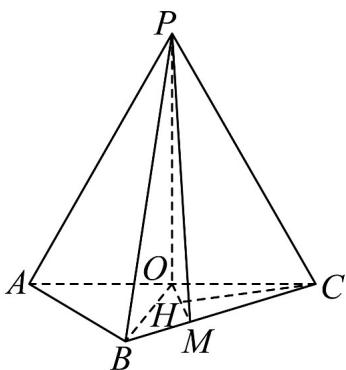
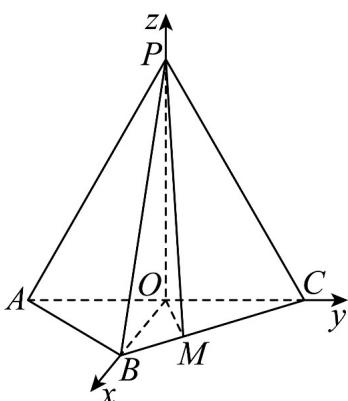

> [!faq]- 《专题21 立体几何大题综合》真题解析
>
> > [!success]- **【答案】** 详见解析
>
> > [!note]- **【分析】**
> > （1）连接 OB，欲证 $PO \perp$ 平面 ABC，只需证明 $PO \perp AC, PO \perp OB$ 即可；
> >
> > (2) 方法一：过点 $C$ 作 $CH \perp OM$ ，垂足为 $M$ ，只需论证 $CH$ 的长即为所求，再利用平面几何知识求解即可·
>
> > [!note]- **【解析】**
> > （1）因为 $AP = CP = AC = 4$ ， $O$ 为 $AC$ 的中点，所以 $OP \perp AC$ ，且 $OP = 2\sqrt{3}$
> > 连结 $OB$ 。因为 $AB = BC = \frac{\sqrt{2}}{2} AC$ ， $AB^2 + BC^2 = AC^2$ ，所以 $\triangle ABC$ 为等腰直角三角形，且 $OB \perp AC$ ， $OB = \frac{1}{2} AC = 2$ 。由 $OP^2 + OB^2 = PB^2$ 知， $OP \perp OB$ 。
> > 由 $OP \perp OB$ ， $OP \perp AC$ ， $OB \cap AC = O$ ，知 $PO \perp$ 平面 ABC。
> > 
> > (2) [方法一]：【最优解】定义法
> > 作 $CH^{\perp}OM$ ，垂足为 $H$ 。又由（1）易知 $OP\perp$ 平面 $ABC$ ，从而 $OP\perp CH$
> > 所以 $CH^{\perp}$ 平面 $POM$ 。故 $CH$ 的长为点 $C$ 到平面 $POM$ 的距离。
> > 由题设可知 $OC=\frac{1}{2}AC=2$ ， $CM=\frac{2}{3}BC=\frac{4\sqrt{2}}{3}$ ， $\angle ACB=45^{\circ}$
> > 所以 $OM = \frac{2\sqrt{5}}{3}$ ， $CH = \frac{OC\cdot MC\cdot\sin\angle ACB}{OM} = \frac{4\sqrt{5}}{5}$
> > 所以点 $C$ 到平面 $POM$ 的距离为 $\frac{4\sqrt{5}}{5}$
> > [方法二]：等积法
> > 设 C 到平面 POM 的距离为 h，由 $(1)$ 知 PO 即为 P 到平面 COM 的距离，且 $PO \perp OM$ ．又 $PO = 2\sqrt{3}$ ，在 $\triangle OMC$ 中， $OC = 2, CM = \frac{2}{3} BC = \frac{4\sqrt{2}}{3}, \angle ACB = 45^{\circ}$ ，则由余弦定理得 $OM = \frac{2\sqrt{5}}{3}$ ，
> > 则 $V_{C-POM}=V_{P-COM}$ ，即 $\frac{1}{3}S_{\triangle POM}\cdot h=\frac{1}{3}S_{\triangle COM}\cdot PO$ ，则 $h=\frac{S_{\triangle COM}\cdot PO}{S_{\triangle POM}}=\frac{2\sqrt{3}\times\frac{2}{3}\times\frac{1}{2}\times2^{2}}{\frac{1}{2}\times2\sqrt{3}\times\frac{2\sqrt{5}}{3}}=\frac{4\sqrt{5}}{5}$ ．即点 C 到平面 POM 的距离为 $\frac{4\sqrt{5}}{5}$ ．
> > [方法三]：向量法
> > 如图，以 O 为原点，建立直角坐标系 Oxyz，设 $P(0,0,2\sqrt{3})$ ， $B(2,0,0)$ ， $O(0,0,0)$ ， $M\left(\frac{4}{3},\frac{2}{3},0\right)$ ， $C(0,2,0)$ ， $OP = (0, 0, 2\sqrt{3})$ ， $OM = \left(\frac{4}{3}, \frac{2}{3}, 0\right)$ ， $OC = (0, 2, 0)$ 。
> > 
> > 设平面的一个法向量，则 $\left\{ \begin{array}{l} \overrightarrow{OP} \cdot n = 0 \\ \overrightarrow{OM} \cdot n = 0 \end{array} \right. \Rightarrow \left\{ \begin{array}{l} 2\sqrt{3}z = 0 \\ \frac{4}{3}x + \frac{2}{3}y = 0 \\ x = -1 \end{array} \right.$ ，令，则，所以，点 $C$ 到平面 $POM$ 的距离为 $\frac{|n \cdot QC|}{|n|} = \frac{4\sqrt{5}}{5}$ 。
> > 【整体点评】（2）方法一：根据定义法求点到面的距离，是解决点面距问题的首选方法，特别是题目中
> > 含有面面垂直的条件，计算简单，是该题的最优解；
> > 方法二：根据等积法求点到面的距离，也是解决点面距问题的常用方法；
> > 方法三：当题目中有较好的建系条件，利用向量法解决点面距，思想简单，过程稍繁。
