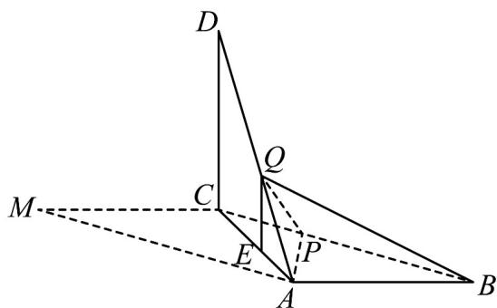

> [!faq]- 《专题21 立体几何大题综合》真题解析
>
> > [!success]- **【答案】** 详见解析
>
> > [!note]- **【分析】**
> > 【分析】(1)根据题意可得 $BA \perp AC$ ，又 $BA \perp AD$ ，利用线面垂直的判定定理证得 $AB \perp$ 平面 $ACD$ ，再根据面面垂直的判定定理即可证得；
> >
> > (2)方法一：根据平面知识求出 $S_{\triangle ABP}$ ，再求得三棱锥的高，即可根据三棱锥的体积公式求出
>
> > [!note]- **【解析】**
> > 【详解】（1）由已知可得， $\angle BAC = 90^{\circ}$ ， $BA \perp AC$
> > 又 $BA \perp AD$ ，且 $AC \cap AD = A$ ，所以 $AB \perp$ 平面 $ACD$ 。
> > 又 $AB \subset$ 平面 ABC ，所以平面 $ACD \perp$ 平面 ABC .
> > 
> > (2) [方法一]：定义法
> > 由已知可得， $DC=CM=AB=3$ ， $DA=3\sqrt{2}$ ．又 $BP=DQ=\frac{2}{3}DA$ ，所以 $BP=2\sqrt{2}$
> > 作 $QE^{\perp}AC$ ，垂足为 $E$ ，则 $QE = \frac{1}{3} DC$
> > 由已知及（1）可得 $DC \perp$ 平面 ABC，所以 $QE \perp$ 平面 ABC， $QE = 1$ .
> > 因此，三棱锥 Q - ABP 的体积为
> > $$
> > V _ {Q - A B P} = \frac {1}{3} \times Q E \times S _ {\triangle A B P} = \frac {1}{3} \times 1 \times \frac {1}{2} \times 3 \times 2 \sqrt {2} \sin 4 5 ^ {\circ} = 1
> > $$
> > [方法二]：转化法
> > 由（1）知， $DC\perp AB$ ，又 $DC\perp CA,AB\cap CA = A$ ，所以 $DC\perp$ 平面ABC，则 $V_{D - ABC} = \frac{1}{3} S_{\triangle ABC}\cdot DC = \frac{9}{2}$ 因为 $DQ = \frac{2}{3} DA,AQ = \frac{1}{3} DA$ ，所以 $V_{Q - ABC} = \frac{1}{3} V_{D - ABC} = \frac{3}{2}$ 因为 $BP = \frac{2}{3} DA = \frac{2}{3} BC$ ，所以 $V_{Q - ABP} = \frac{2}{3} V_{Q - ABC} = 1$
> > 【整体点评】（2）方法一：根据三棱锥的体积公式求底面积和高，是求三棱锥体积的通性通法；
> > 方法二：根据题目的等量关系转化为求易求的三棱锥体积，也是求三棱锥体积的通性通法。
